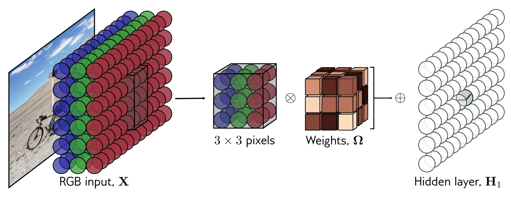

  

  <strong>Figure 10.10</strong> 2D convolution applied to an image. The image is treated as a 2D input with three channels corresponding to the red, green, and blue components. With a $3 \times 3$ kernel, each pre-activation in the first hidden layer is computed by pointwise multiplying the $3 \times 3 \times 3$ kernel weights with the $3 \times 3$ RGB image patch centered at the same position, summing, and adding the bias. To calculate all the pre-activations in the hidden layer, we “slide” the kernel over the image in both horizontal and vertical directions. The output is a 2D layer of hidden units. To create multiple output channels, we would repeat this process with multiple kernels, resulting in a 3D tensor of hidden units at hidden layer $H\_{1}$ .

can sample every other position. When we use a stride of two, we effectively apply this method simultaneously with the convolution operation (figure 10.11a).

Second, max pooling retains the maximum of the $2 \times 2$ input values (figure 10.11b). This induces some invariance to translation; if the input is shifted by one pixel, many of these maximum values remain the same. Finally, mean pooling or average pooling averages the inputs. For all approaches, we apply downsampling separately to each channel, so the output has half the width and height but the same number of channels.

## 10.4.2 Upsampling

The simplest way to scale up a network layer to double the resolution is to duplicate all the channels at each spatial position four times (figure 10.12a). A second method that methods, there were half as many outputs as inputs, and for kernel size three, each output was a weighted sum of the three closest inputs (figure 10.13a). In transposed convolution, this picture is reversed (figure 10.13c). There are twice as many outputs

A fourth approach is roughly analogous to downsampling using a stride of two. In that method, there were half as many outputs as inputs, and for kernel size three, each output was a weighted sum of the three closest inputs (figure 10.13a). In transposed convolution, this picture is reversed (figure 10.13c). There are twice as many outputs
