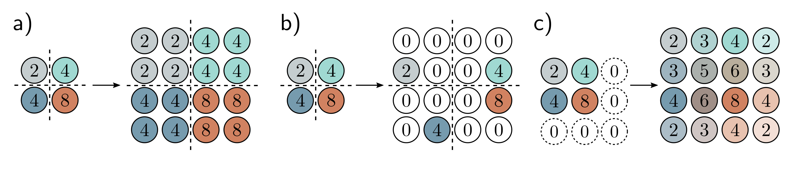
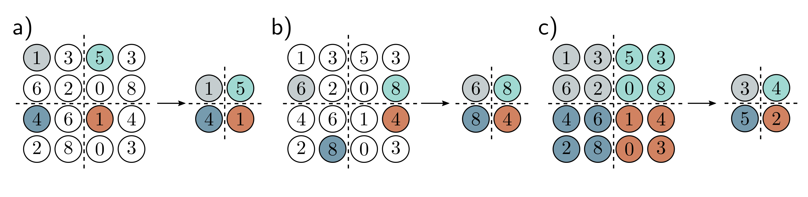

  

  <strong>Figure 10.11</strong> Methods for scaling down representation size (downsampling). a) Sub-sampling. The original  $4 \times 4$  representation (left) is reduced to size  $2 \times 2$  (right) by retaining every other input. Colors on the left indicate which inputs contribute to the outputs on the right. This is effectively what happens with a kernel of stride two, except that the intermediate values are never computed. b) Max pooling. Each output comprises the maximum value of the corresponding  $2 \times 2$  block. c) Mean pooling. Each output is the mean of the values in the  $2 \times 2$  block.

  

  <strong>Figure 10.12</strong> Methods for scaling up representation size (upsampling). a) The simplest way to double the size of a 2D layer is to duplicate each input four times. b) In networks where we have previously used a max pooling operation (figure 10.11b), we can redistribute the values to the same positions they originally came from (i.e., where the maxima were). This is known as max unpooling. c) A third option is bilinear interpolation between the input values.

**Figure 3**

b)

c)

d)

**Figure 6**

  

  <strong>Figure 10.13</strong> Transposed convolution in 1D. a) Downsampling with kernel size three, stride two, and zero-padding. Each output is a weighted sum of three inputs (arrows indicate weights). b) This can be expressed by a weight matrix (same color indicates shared weight). c) In transposed convolution, each input contributes three values to the output layer, which has twice as many outputs as inputs. d) The associated weight matrix is the transpose of that in panel (b).

