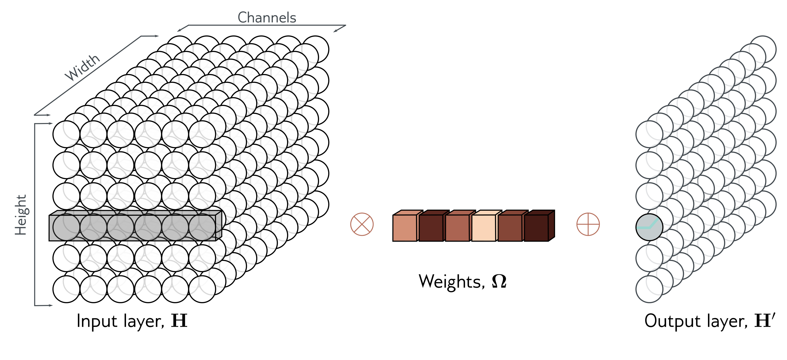
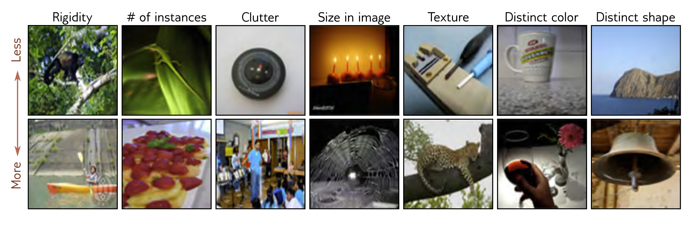

  

  <strong>Figure 10.14</strong> $1 \times 1$ convolution. To change the number of channels without spatial pooling, we apply a $1 \times 1$ kernel. Each output channel is computed by taking a weighted sum of all of the channels at the same position, adding a bias, and passing through an activation function. Multiple output channels are created by repeating this operation with different weights and biases.

  

  <strong>Figure 10.15</strong> Example ImageNet classification images. The model aims to assign an input image to one of 1000 classes. This task is challenging because the images vary widely along different attributes (columns). These include rigidity (monkey < canoe), number of instances in image (lizard < strawberry), clutter (compass < steel drum), size (candle < spiderweb), texture (screwdriver < leopard), distinctiveness of color (mug < red wine), and distinctiveness of shape (headland < bell). Adapted from Russakovsky et al. (2015).

