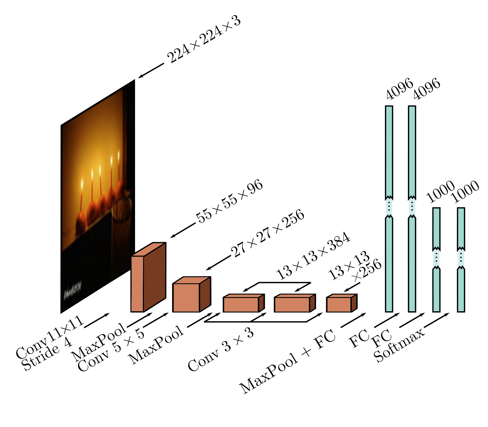

  

  <strong>Figure 10.16</strong> AlexNet (Krizhevsky et al., 2012). The network maps a $224 \times 224$ color image to a 1000-dimensional vector representing class probabilities. The network first convolves with $11 \times 11$ kernels and strides 4 to create 96 channels. It decreases the resolution again using a max pool operation and applies a $5 \times 5$ convolutional layer. Another max pooling layer follows, and three $3 \times 3$ convolutional layers are applied. After a final max pooling operation, the result is vectorized and passed through three fully connected (FC) layers and finally the softmax layer.

downsampling the input using an $11 \times 11$ kernel with a stride of four to create 96 channels. It then downsamples again using a max pooling layer before applying a $5 \times 5$ kernel to create 256 channels. There are three more convolutional layers with kernel size $3 \times 3$ , eventually resulting in a $13 \times 13$ representation with 256 channels. A final max-pooling layer yields a $6 \times 6$ representation with 256 channels which is resized into a vector of length 9, 216 and passed through three fully connected layers containing 4096, 4096, and 1000 hidden units, respectively. The last layer is passed through the softmax function to output a probability distribution over the 1000 classes. The complete network contains $\sim$ 60 million parameters, most of which are in the fully connected layers.
The dataset size was augmented by a factor of 2048 using (i) spatial transformations and (ii) modifications of the input intensities. At test time, five different cropped and mirrored versions of the image were run through the network, and their predictions averaged. The system was learned using SGD with a momentum coefficient of 0.9 and a batch size of 128. Dropout was applied in the fully connected layers, and an L2 (weight decay) regularizer was used. This system achieved a 16.4% top-5 error rate and a 38.1% top-1 error rate. At the time, this was an enormous leap forward in performance at a task considered far beyond the capabilities of contemporary methods. This result revealed the potential of deep learning and kick-started the modern era of AI research.

The VGG network was also targeted at classification in the ImageNet task and achieved a considerably better performance of 6.8% top-5 error rate and a 23.7% top-1 error rate. This network is similarly composed of a series of interspersed convolutional and max pooling layers, where the spatial size of the representation gradually decreases, but the number of channels increases. These are followed by three fully connected layers (figure 10.17). The VGG network was also trained using data augmentation, weight decay, and dropout.

Although there were various minor differences in the training regime, the most important change between AlexNet and VGG was the depth of the network. The latter used 19 hidden layers and 144 million parameters. The networks in figures 10.16 and 10.17 are depicted at the same scale for comparison. There was a general trend for several years for performance on this task to improve as the depth of the networks increased, and this is evidence that depth is important in neural networks.
