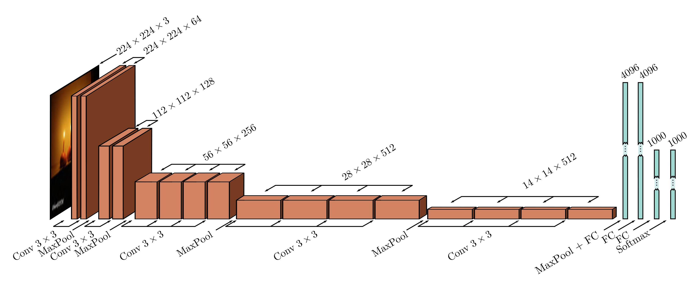

  

  <strong>Figure 10.17</strong> VGG network (Simonyan & Zisserman, 2014) depicted at the same scale as AlexNet (see figure 10.16). This network consists of a series of convolutional layers and max pooling operations, in which the spatial scale of the representation gradually decreases, but the number of channels gradually increases. The hidden layer after the last convolutional operation is resized to a 1D vector and three fully connected layers follow. The network outputs 1000 activations corresponding to the class labels that are passed through a softmax function to create class probabilities.

## 10.5.2 Object detection

In object detection, the goal is to identify and localize multiple objects within the image. An early method based on convolutional networks was You Only Look Once, or YOLO for short. The input to the YOLO network is a  $448 \times 448$  RGB image. This is passed through 24 convolutional layers that gradually decrease the representation size using max pooling operations while concurrently increasing the number of channels, similarly to the VGG network. The final convolutional layer is of size  $7 \times 7$  and has 1024 channels. This is reshaped to a vector, and a fully connected layer maps it to 4096 values. One further fully connected layer maps this representation to the output.

The output values encode which class is present at each of a  $7 \times 7$  grid of locations (figure 10.18a–b). For each location, the output values also encode a fixed number of bounding boxes. Five parameters define each box: the x- and y-position of the center, the height and width of the box, and the confidence of the prediction (figure 10.18c). The confidence estimates the overlap between the predicted and ground truth bounding boxes. The system is trained using momentum, weight decay, dropout, and data augmentation. Transfer learning is employed; the network is initially trained on the ImageNet classification task and is then fine-tuned for object detection.

After the network is run, a heuristic process is used to remove rectangles with low confidence and to suppress predicted bounding boxes that correspond to the same object so only the most confident one is retained.
