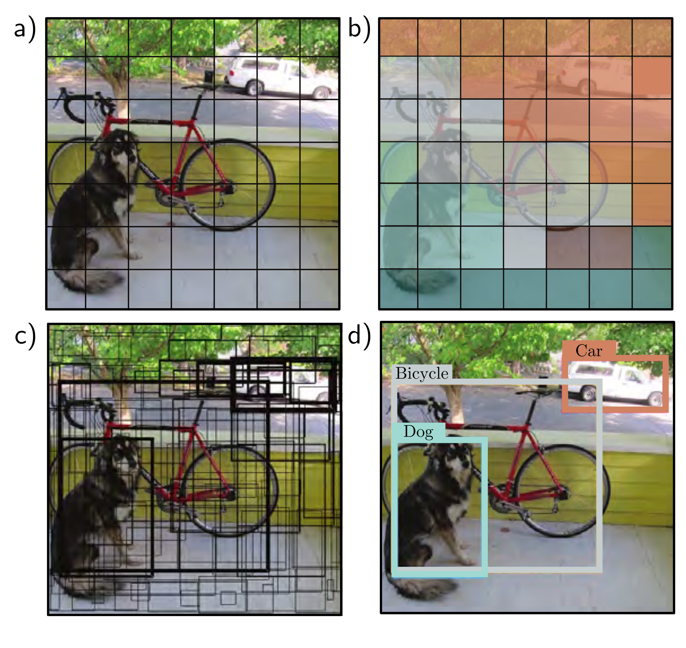

  

  <strong>Figure 10.18</strong> YOLO object detection. a) The input image is reshaped to $448 \times 448$ and divided into a regular $7 \times 7$ grid. b) The system predicts the most likely class at each grid cell. c) It also predicts two bounding boxes per cell, and a confidence value (represented by thickness of line). d) During inference, the most likely bounding boxes are retained, and boxes with lower confidence values that belong to the same object are suppressed. Adapted from Redmon et al. (2016).

## 10.5.3 Semantic segmentation

The goal of semantic segmentation is to assign a label to each pixel according to the object that it belongs to or no label if that pixel does not correspond to anything in the training database. An early network for semantic segmentation is depicted in figure 10.19. The input is a $224 \times 224$ RGB image, and the output is a $224 \times 224 \times 21$ array that contains the probability of each of 21 possible classes at each position.

The first part of the network is a smaller version of VGG (figure 10.17) that contains that it belongs to or no label if that pixel does not correspond to anything in the training database. An early network for semantic segmentation is depicted in figure 10.19. The input is a $224 \times 224$ RGB image, and the output is a $224 \times 224 \times 21$ array that contains the probability of each of 21 possible classes at each position.

Here, the architecture diverges from VGG. Another fully connected layer reconstitutes the representation into $7 \times 7$ spatial positions and 512 channels. This is followed
