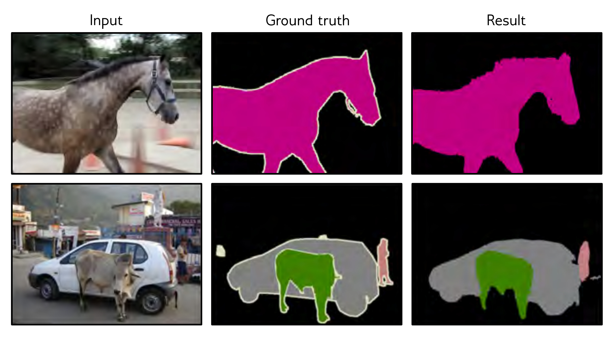

  

  <strong>Figure 10.20</strong> Semantic segmentation results. The final result is created from the 21 probability maps by greedily selecting the best class and using a heuristic method to find a sensible binary map based on the probabilities and their spatial proximity. If there is enough evidence, subsequent classes are added, and their segmentation maps are combined. Adapted from Noh et al. (2015).

different weights and biases to create multiple channels at each spatial position.

Typical convolutional networks consist of convolutional layers interspersed with layers that downsample by a factor of two. As a data example passes through the network, the spatial dimensions usually decrease by factors of two, and the channels increase by factors of two. At the end of the network, there are typically one or more fully connected layers that integrate information from across the entire input and create the desired output. If the output is an image, a mirrored “decoder” upsamples back to the original size.

The translational equivariance of convolutional layers imposes a useful inductive bias that increases performance for image-based tasks relative to fully connected networks. We described image classification, object detection, and semantic segmentation networks. Image classification performance was shown to improve as the network became deeper. However, subsequent experiments showed that increasing the network depth indefinitely doesn’t continue to help; after a certain depth, the system becomes difficult to train. This is the motivation for residual connections, which are the topic of the next chapter.

## Notes

Dumoulin & Visin (2016) present an overview of the mathematics of convolutions that expands on the brief treatment in this chapter.

Convolutional networks: Early convolutional networks were developed by Fukushima & Miyake (1982), LeCun et al. (1989a), and LeCun et al. (1989b). Initial applications included
