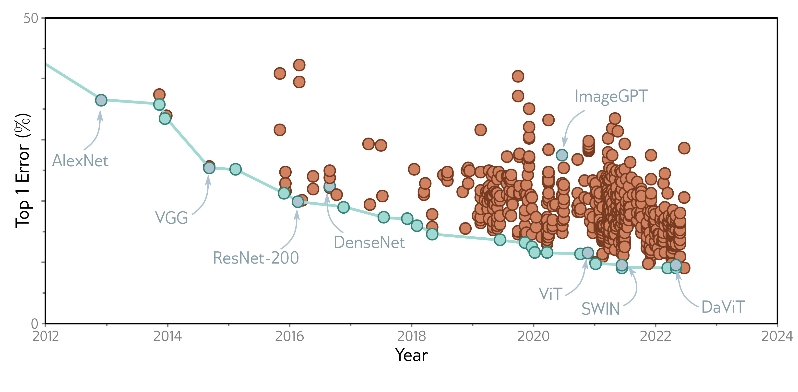

  

  <strong>Figure 10.21</strong> ImageNet performance. Each circle represents a different published model. Blue circles represent models that were state-of-the-art. Models discussed in this book are also highlighted. The AlexNet and VGG networks were remarkable for their time but are now far from state of the art. ResNet-200 and DenseNet are discussed in chapter 11. ImageGPT, ViT, SWIN, and DaViT are discussed in chapter 12. Adapted from https://paperswithcode.com/sota/image-classification-on-imagenet.

an  $L_{\infty}$  norm to the hidden units that are to be pooled. This led to applying other  $L_{k}$  norms (Springenberg et al., 2015; Sainath et al., 2013), although these require more computation and are not widely used. Zhang (2019) introduced max-blur-pooling, in which a low-pass filter is applied before downsampling to prevent aliasing, and showed that this improves generalization over translation of inputs and protects against adversarial attacks (see section 20.4.6).

Shi et al. (2016) introduced PixelShuffle, which used convolutional filters with a stride of 1/s to scale up 1D signals by a factor of s. Only the weights that lie exactly on positions are used to create the outputs, and the ones that fall between positions are discarded. This can be implemented by multiplying the number of channels in the kernel by a factor of s, where the  $s^{th}$  output position is computed from just the  $s^{th}$  subset of channels. This can be trivially extended to 2D convolution, which requires  $s^{2}$  channels.

Convolution in 1D and 3D: Convolutional networks are usually applied to images but have also been applied to 1D data in applications that include speech recognition (Abdel-Hamid et al., 2012), sentence classification (Zhang et al., 2015; Conneau et al., 2017), electrocardiogram classification (Kiranyaz et al., 2015), and bearing fault diagnosis (Eren et al., 2019). A survey of 1D convolutional networks can be found in Kiranyaz et al. (2021). Convolutional networks have also been applied to 3D data, including video (Ji et al., 2012; Saha et al., 2016; Tran et al., 2015) and volumetric measurements (Wu et al., 2015b; Maturana & Scherer, 2015).

Invariance and equivariance: Part of the motivation for convolutional layers is that they are approximately equivariant with respect to translation, and part of the motivation for max
