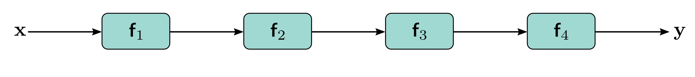

  

  <strong>Figure 11.1</strong> Sequential processing. Standard neural networks pass the output of each layer directly into the next layer.

linear transformation. In a convolutional network, each layer consists of a set of convolutions followed by an activation function, and the parameters comprise the convolutional kernels and biases.

Since the processing is sequential, we can equivalently think of this network as a series of nested functions:

$$
\mathbf{y}=\mathbf{f}_{4}\left[\mathbf{f}_{3}\Big[\mathbf{f}_{2}\big[\mathbf{f}_{1}[\mathbf{x},\boldsymbol{\phi}_{1}],\boldsymbol{\phi}_{2}\big],\boldsymbol{\phi}_{3}\Big],\boldsymbol{\phi}_{4}\right]. \quad (11.2)
$$

## 11.1.1 Limitations of sequential processing

In principle, we can add as many layers as we want, and in the previous chapter, we saw that adding more layers to a convolutional network does improve performance; the VGG network (figure 10.17), which has nineteen layers, outperforms AlexNet (figure 10.16), which has eight layers. However, image classification performance decreases again as further layers are added (figure 11.2). This is surprising since models generally perform better as more capacity is added (figure 8.10). Indeed, the decrease is present for both the training set and the test set, which implies that the problem is training deeper networks rather than the inability of deeper networks to generalize.

This phenomenon is not completely understood. One conjecture is that right after initialization, the loss gradients change unpredictably when we modify parameters in early network layers. With appropriate initialization of the weights (see section 7.5), the gradient of the loss with respect to these parameters will be reasonable (i.e., no exploding or vanishing gradients). However, the derivative assumes an infinitesimal change in the parameter, whereas optimization algorithms use a finite step size. Any reasonable choice of step size may move to a place with a completely different and unrelated gradient; the loss surface looks like an enormous range of tiny mountains rather than a single smooth structure that is easy to descend. Consequently, the algorithm doesn’t make progress in

This conjecture is supported by empirical observations of gradients in networks with a single input and output. For a shallow network, the gradient of the output with respect to the input changes slowly as we change the input (figure 11.3a). However, for a deep network, a tiny change in the input results in a completely different gradient (figure 11.3b). This is captured by the autocorrelation function of the gradient (fig-ure 11.3c). Nearby gradients are correlated for shallow networks, but this correlation quickly drops to zero for deep networks. This is termed the shattered gradients phenomenon.

Notebook B.2.1
Shattered gradients
