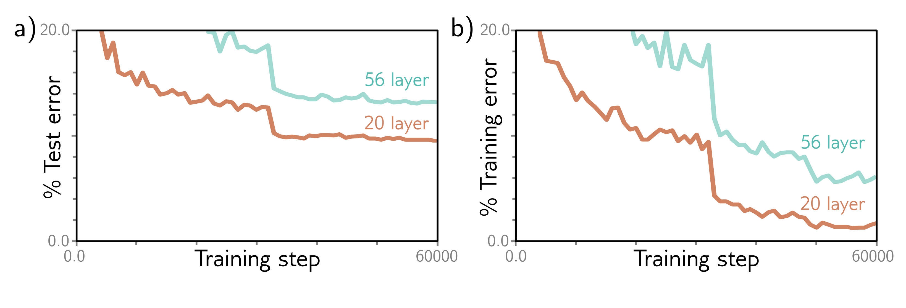
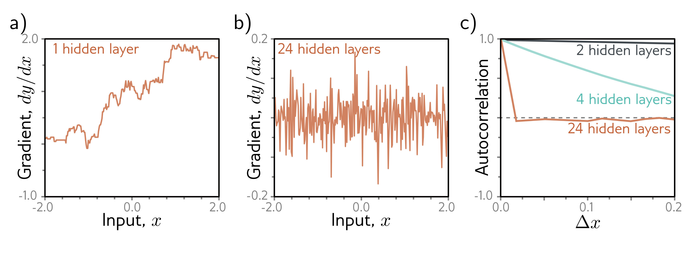

b)

  

  <strong>Figure 11.2</strong> Decrease in performance when adding more convolutional layers. a) A 20-layer convolutional network outperforms a 56-layer neural network for image classification on the test set of the CIFAR-10 dataset (Krizhevsky & Hinton, 2009). b) This is also true for the training set, which suggests that the problem relates to training the original network rather than a failure to generalize to new data. Adapted from He et al. (2016a).

b)

c)

  

  <strong>Figure 11.3</strong> Shattered gradients. a) Consider a shallow network with 200 hidden units and Glorot initialization (He initialization without the factor of two) for both the weights and biases. The gradient  $\partial y/\partial x$  of the scalar network output y with respect to the scalar input x changes relatively slowly as we change the input x. b) For a deep network with 24 layers and 200 hidden units per layer, this gradient changes very quickly and unpredictably. c) The autocorrelation function of the gradient shows that nearby gradients become unrelated (have autocorrelation close to zero) for deep networks. This shattered gradient's phenomenon may explain why it is hard to train deep networks. Gradient descent algorithms rely on the loss surface being relatively smooth, so the gradients should be related before and after each update step. Adapted from Balduzzi et al. (2017).

