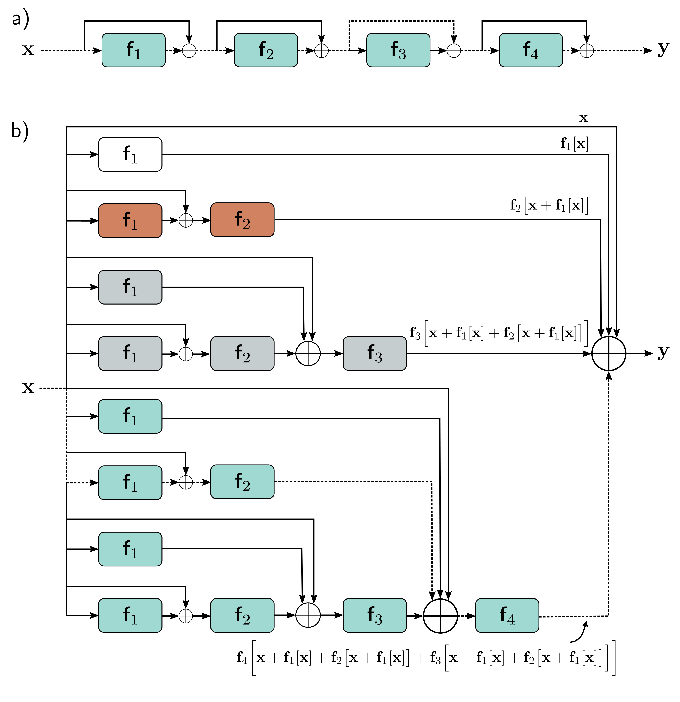

  

  <strong>Figure 11.4</strong> Residual connections. a) The output of each function $f_{k}[x, \phi_{k}]$ is added back to its input, which is passed via a parallel computational path called a residual or skip connection. Hence, the function computes an additive change to the representation. b) Upon expanding (unraveling) the network as a combination of 16 different paths through the computational graph. One example is the dashed path from input x to output y, which is the same in panels (a) and (b).

