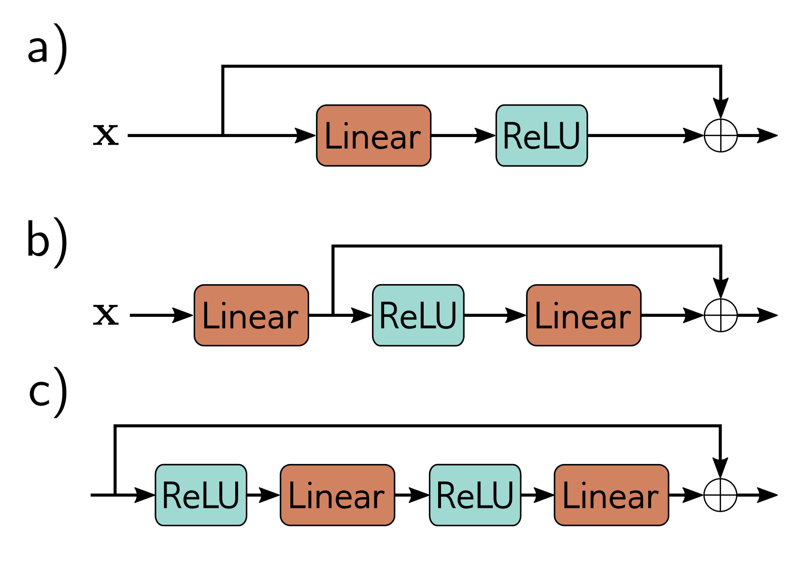

  

  <strong>Figure 11.5</strong> Order of operations in residual blocks. a) The usual order of linear transformation or convolution followed by a ReLU nonlinearity means that each residual block can only add non-negative quantities. b) With the reverse order, both positive and negative quantities can be added. However, we must add a linear transformation at the start of the network in case the input is all negative. c) In practice, it’s common for a residual block to contain several network layers.

interpretation is that residual connections turn the original network into an ensemble of these smaller networks whose outputs are summed to compute the result.

A complementary way of thinking about this residual network is that it creates sixteen paths with differing numbers of transformations between input and output. For example, the first function $f_{1}[x]$ occurs in eight of these sixteen paths, including as a direct additive term (i.e., a path length of one), and the analogous derivative to equation 11.3 is:

$$
\begin{aligned}
\frac{\partial \mathbf{y}}{\partial \mathbf{f}_1}
&= \mathbf{I}+\frac{\partial \mathbf{f}_2}{\partial \mathbf{f}_1} \\
&\quad +\left(\frac{\partial \mathbf{f}_3}{\partial \mathbf{f}_1}+\frac{\partial \mathbf{f}_2}{\partial \mathbf{f}_1}\frac{\partial \mathbf{f}_3}{\partial \mathbf{f}_2}\right) \\
&\quad +\left(\frac{\partial \mathbf{f}_4}{\partial \mathbf{f}_1}+\frac{\partial \mathbf{f}_2}{\partial \mathbf{f}_1}\frac{\partial \mathbf{f}_4}{\partial \mathbf{f}_2}+\frac{\partial \mathbf{f}_3}{\partial \mathbf{f}_1}\frac{\partial \mathbf{f}_4}{\partial \mathbf{f}_3}+\frac{\partial \mathbf{f}_2}{\partial \mathbf{f}_1}\frac{\partial \mathbf{f}_3}{\partial \mathbf{f}_2}\frac{\partial \mathbf{f}_4}{\partial \mathbf{f}_3}\right)
\end{aligned}\qquad (11.6)
$$

where there is one term for each of the eight paths. The identity term on the right-hand side shows that changes in the parameters $\phi_{1}$ in the first layer $f_{1}[x,\phi_{1}]$ contribute directly to changes in the network output y. They also contribute indirectly through the other chains of derivatives of varying lengths. In general, gradients through shorter paths will be better behaved. Since both the identity term and various short chains of derivatives will contribute to the derivative for each layer, networks with residual links suffer less from shattered gradients.

## 11.2.1 Order of operations in residual blocks

Until now, we have implied that the additive functions f[x] could be any valid network layer (e.g., fully connected or convolutional). This is technically true, but the order of operations in these functions is important. They must contain a nonlinear activation function like a ReLU, or the entire network will be linear. However, in a typical network layer (figure 11.5a), the ReLU function is at the end, so the output is non-negative. If we adopt this convention, then each residual block can only increase the input values.

Hence, it is typical to change the order of operations so that the activation function is applied first, followed by the linear transformation (figure 11.5b). Sometimes there may be several layers of processing within the residual block (figure 11.5c), but these usually terminate with a linear transformation. Finally, we note that when we start these blocks with a ReLU operation, they will do nothing if the initial network input is negative since the ReLU will clip the entire signal to zero. Hence, it’s typical to start the network with a linear transformation rather than a residual block, as in figure 11.5b.
