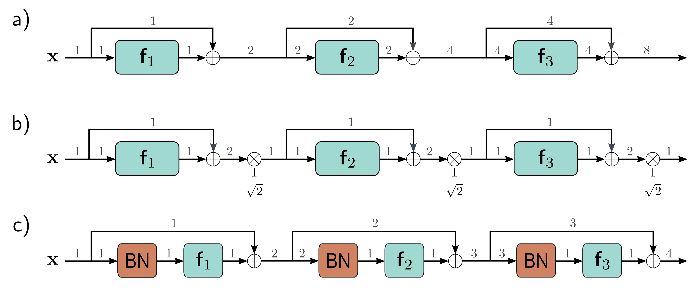

b)

c)

  

  <strong>Figure 11.6</strong> Variance in residual networks. a) He initialization ensures that the expected variance remains unchanged after a linear plus ReLU layer  $f_{k}$ . Unfortunately, in residual networks, the input of each block is added back to the output, so the variance doubles at each layer (gray numbers indicate variance) and grows exponentially. b) One approach would be to rescale the signal by  $1/\sqrt{2}$  between each residual block. c) A second method uses batch normalization (BN) as the first step in the residual block and initializes the associated offset  $\delta$  to zero and scale  $\gamma$  to one. This transforms the input to each layer to have unit variance, and with He initialization, the output variance will also be one. Now the variance increases linearly with the number of residual blocks. A side-effect is that, at initialization, later network layers are dominated by the residual connection and are hence close to computing the identity.

$$
\begin{array}{rcl}m_{h}&=&\frac{1}{\left|\mathcal{B}\right|}\sum\limits_{i\in\mathcal{B}}h_{i}\\s_{h}&=&\sqrt{\frac{1}{\left|\mathcal{B}\right|}\sum\limits_{i\in\mathcal{B}}(h_{i}-m_{h})^{2}},\end{array} \quad (11.7)
$$

where all quantities are scalars. Then we use these statistics to standardize the batch activations to have mean zero and unit variance:

$$
s_{h}\quad=\quad\sqrt{\frac{1}{\left|\mathcal{B}\right|}\sum_{i\in\mathcal{B}}(h_{i}-m_{h})^{2}}, \quad (11.7)
$$

where $\epsilon$ is a small number that prevents division by zero if $h_{i}$ is the same for every member of the batch and $s_{h}=0$.

Finally, the normalized variable is scaled by $\gamma$ and shifted by $\delta$:

$$
h_{i}\leftarrow\gamma h_{i}+\delta\qquad\quad\forall i\in\mathcal{B}. \quad (11.9)
$$

Draft: please send errata to udlbookmail@gmail.com.
