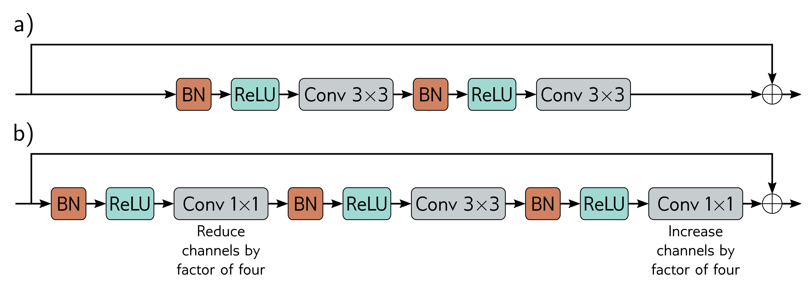
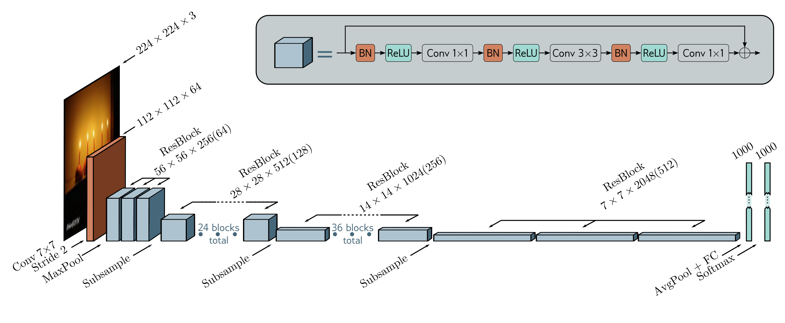

  

  <strong>Figure 11.7</strong> ResNet blocks. a) A standard block in the ResNet architecture contains a batch normalization operation, followed by an activation function, and a $3 \times 3$ convolutional layer. Then, this sequence is repeated. b). A bottleneck ResNet block still integrates information over a $3 \times 3$ region but uses fewer parameters. It contains three convolutions. The first $1 \times 1$ convolution reduces the number of channels. The second $3 \times 3$ convolution is applied to the smaller representation. A final $1 \times 1$ convolution increases the number of channels again so that it can be added back to the input.

  

  <strong>Figure 11.8</strong> ResNet-200 model. A standard $7 \times 7$ convolutional layer with stride two is applied, followed by a MaxPool operation. A series of bottleneck residual blocks follow (number in brackets is channels after first $1 \times 1$ convolution), with periodic downsampling and accompanying increases in the number of channels. The network concludes with average pooling across all spatial positions and a fully connected layer that maps to pre-softmax activations.

