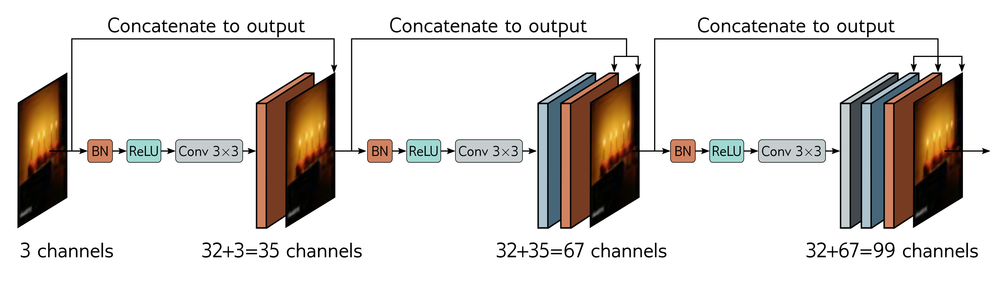

  

  <strong>Figure 11.9</strong> DenseNet. This architecture uses residual connections to concatenate the outputs of earlier layers to later ones. Here, the three-channel input image is processed to form a 32-channel representation. The input image is concatenated to this to give a total of 35 channels. This combined representation is processed to create another 32-channel representation, and both earlier representations are concatenated to this to create a total of 67 channels and so on.

(in terms of channels for a convolutional network), but an optional subsequent linear transformation can map back to the original size (a  $1 \times 1$  convolution for a convolutional network). This allows the model to add the representations together, take a weighted sum, or combine them in a more complex way.

The DenseNet architecture uses concatenation so that the input to a layer comprises the concatenated outputs from all previous layers (figure 11.9). These are processed to create a new representation that is itself concatenated with the previous representation and passed to the next layer. This concatenation means there is a direct contribution from earlier layers to the output, so the loss surface behaves reasonably.

In practice, this can only be sustained for a few layers because the number of channels (and hence the number of parameters required to process them) becomes increasingly large. This problem can be alleviated by applying a  $1 \times 1$  convolution to reduce the number of channels before the next  $3 \times 3$  convolution is applied. In a convolutional network, the input is periodically downsampled. Concatenation across the downsampling makes no sense since the representations have different spatial sizes. Consequently, the chain of concatenation is broken at this point, and a smaller representation starts a new chain. In addition, another bottleneck  $1 \times 1$  convolution can be applied when the downsampling occurs to control the representation size further.

This network performs competitively with ResNet models on image classification (see figure 10.21); indeed, it can perform better for a comparable parameter count. This is presumably because it can reuse processing from earlier layers more flexibly.

## 11.5.3 U-Nets and hourglass networks

Section 10.5.3 described a semantic segmentation network that had an encoder-decoder or hourglass structure. The encoder repeatedly downsamples the image until the receptive fields are large and information is integrated from across the image. Then the decoder
