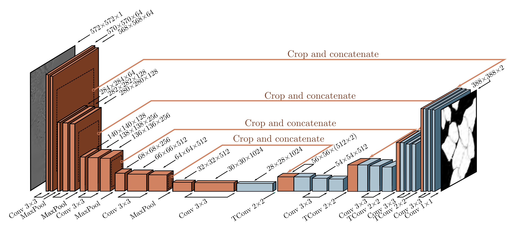

  

  <strong>Figure 11.10</strong> U-Net for segmenting HeLa cells. The U-Net has an encoder-decoder structure, in which the representation is downsampled (orange blocks) and then re-upsampled (blue blocks). The encoder uses regular convolutions, and the decoder uses transposed convolutions. Residual connections append the last representation at each scale in the encoder to the first representation at the same scale in the decoder (orange arrows). The original U-Net used “valid” convolutions, so the size decreased slightly with each layer, even without downsampling. Hence, the representations from the encoder were cropped (dashed squares) before appending to the decoder. Adapted from Ronneberger et al. (2015).

upsamples it back to the size of the original image. The final output is a probability over possible object classes at each pixel. One drawback of this architecture is that the low-resolution representation in the middle of the network must “remember” the high-resolution details to make the final result accurate. This is unnecessary if residual connections transfer the representations from the encoder to their partner in the decoder.

The U-Net (figure 11.10) is an encoder-decoder architecture where the earlier representations are concatenated to the later ones. The original implementation used “valid” convolutions, so the spatial size decreases by two pixels each time a $3 \times 3$ convolutional layer is applied. This means that the upsampled version is smaller than its counterpart in the encoder, which must be cropped before concatenation. Subsequent implementations have used zero-padding, where this cropping is unnecessary. Note that the U-Net is completely convolutional, so after training, it can be run on an image of any size.
