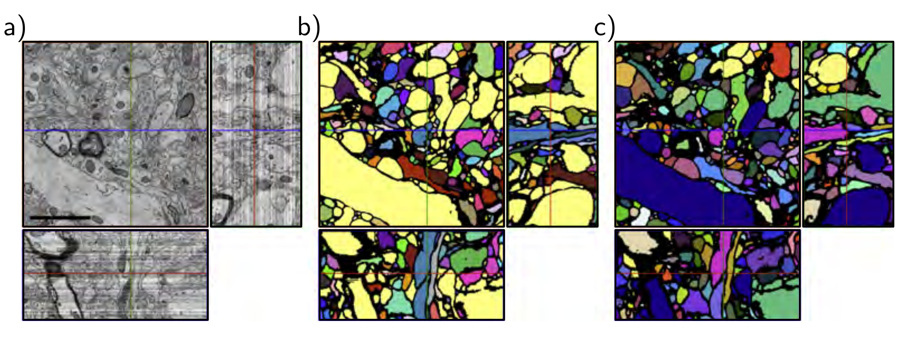

  

  <strong>Figure 11.11</strong> Segmentation using U-Net in 3D. a) Three slices through a 3D volume of mouse cortex taken by scanning electron microscope. b) A single U-Net is used to classify voxels as being inside or outside neurites. Connected regions are identified with different colors. c) For a better result, an ensemble of five U-Nets is trained, and a voxel is only classified as belonging to the cell if all five networks agree. Adapted from Falk et al. (2019).

## 11.6 Why do nets with residual connections perform so well?

Residual networks allow much deeper networks to be trained; it’s possible to extend the ResNet architecture to 1000 layers and still train effectively. The improvement in image classification performance was initially attributed to the additional network depth, but two pieces of evidence contradict this viewpoint.

First, shallower, wider residual networks sometimes outperform deeper, narrower ones with a comparable parameter count. In other words, better performance can sometimes be achieved with a network with fewer layers but more channels per layer. Second, there is evidence that the gradients during training do not propagate effectively through very long paths in the unraveled network (figure 11.4b). In effect, a very deep network may act more like a combination of shallower networks.

The current view is that residual connections add some value of their own, as well as allowing deeper networks to be trained. This perspective is supported by the fact that the loss surfaces of residual networks around a minimum tend to be smoother and more predictable than those for the same network when the skip connections are removed (figure 11.13). This may make it easier to learn a good solution that generalizes well.

## 11.7 Summary

Increasing network depth indefinitely causes both training and test performance for image classification to decrease. This may be because the gradient of the loss with respect to
