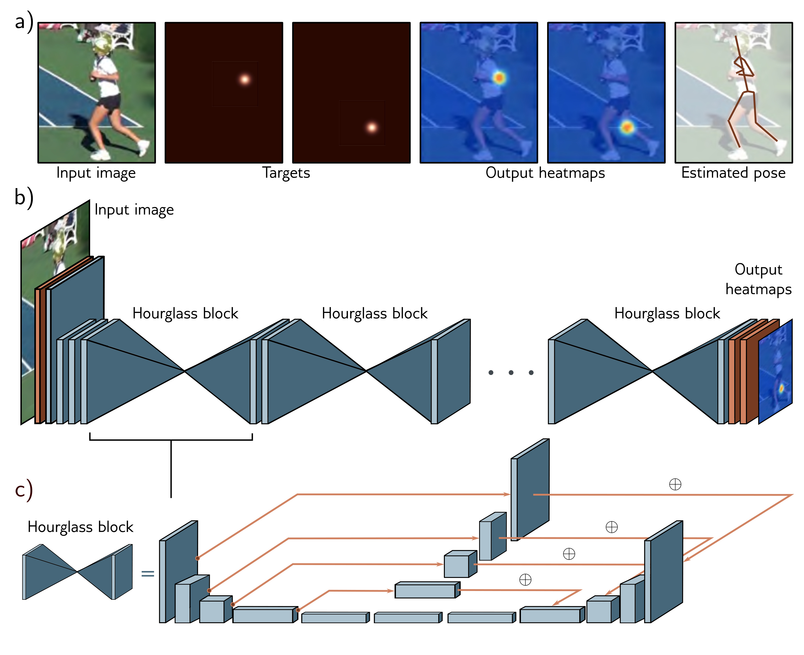

  

  <strong>Figure 11.12</strong> Stacked hourglass networks for pose estimation. a) The network input is an image containing a person, and the output is a set of heatmaps, with one heatmap for each joint. This is formulated as a regression problem where the targets are heatmap images with small, highlighted regions at the ground-truth joint positions. The peak of the estimated heatmap is used to establish each final joint position. b) The architecture consists of initial convolutional and residual blocks that are self-attentive, each hourglass block consisting of an encoder-decoder network similar to the U-Net except that the convolutions use zero-padding, some further processing is done in the residual links, and these links add this processed representation rather than concatenate it. Each blue cuboid is itself a bottleneck residual block (figure 11.7b). Adapted from Newell et al. (2016).

