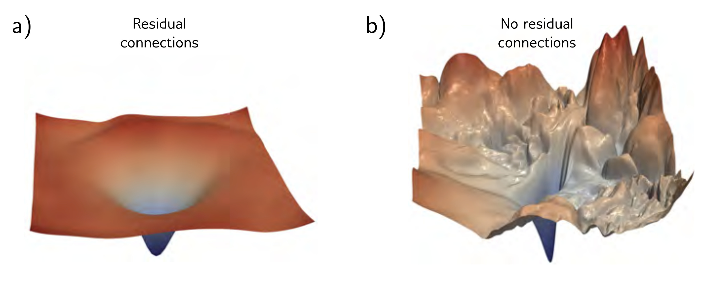

  

  <strong>Figure 11.13</strong> Visualizing neural network loss surfaces. Each plot shows the loss surface in two random directions in parameter space around the minimum found by SGD for an image classification task on the CIFAR-10 dataset. These directions are normalized to facilitate side-by-side comparison. a) Residual net with 56 layers. b) Results from the same network without skip connections. The surface is smoother with the skip connections. This facilitates learning and makes the final network performance more robust to minor errors in the parameters, so it will likely generalize better. Adapted from Li et al. (2018b).

parameters early in the network changes quickly and unpredictably relative to the update step size. Residual connections add the processed representation back to their own input. Now each layer contributes directly to the output as well as indirectly, so propagating gradients through many layers is not mandatory, and the loss surface is smoother.

Residual networks don’t suffer from vanishing gradients but introduce an exponential increase in the variance of the activations during forward propagation and corresponding problems with exploding gradients. This is usually handled by adding batch normalization, which compensates for the empirical mean and variance of the batch and then shifts and rescales using learned parameters. If these parameters are initialized judiciously, very deep networks can be trained. There is evidence that both residual links and batch normalization make the loss surface smoother, which permits larger learning rates. Moreover, the variability in the batch statistics adds a source of regularization.

Residual blocks have been incorporated into convolutional networks. They allow deeper networks to be trained with commensurate increases in image classification performance. Variations of residual networks include the DenseNet architecture, which concatenates outputs of all prior layers to feed into the current layer, and U-Nets, which incorporate residual connections into encoder-decoder models.

## Notes

Residual connections: Residual connections were introduced by He et al. (2016a), who built a network with 152 layers, which was eight times larger than VGG (figure 10.17), and achieved state-of-the-art performance on the ImageNet classification task. Each residual block consisted
