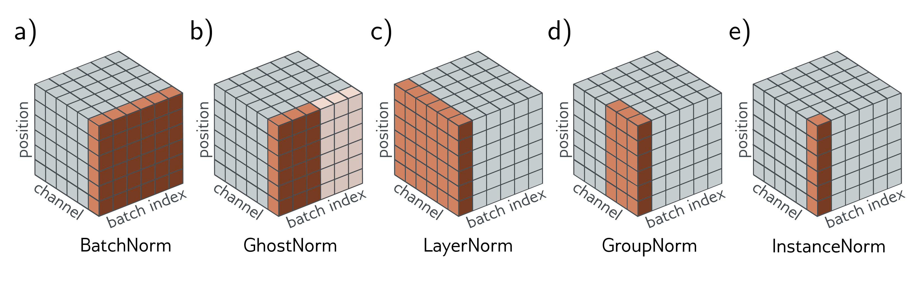

  

  <strong>Figure 11.14</strong> Normalization schemes. BatchNorm modifies each channel separately but adjusts each batch member in the same way based on statistics gathered across the batch and spatial position. Ghost batch normalization computes these statistics from only part of the batch to make them more variable. LayerNorm computes statistics for each batch member separately, based on statistics gathered across the channels and spatial position. It retains a separate learned scaling factor for each channel. GroupNorm normalizes within each group of channels and also retains a separate scale and offset parameter for each channel. Instantaneous normalization within each channel separately, computing the statistics only across spatial position. Adapted from Wu & He (2018).

position alone. Salimans & Kingma (2016) investigated normalizing the network weights rather than the activations, but this has been less empirically successful. Teye et al. (2018) introduced Monte Carlo batch normalization, which can provide meaningful estimates of uncertainty in the predictions of neural networks. A recent comparison of the properties of different normalization schemes can be found in Lubana et al. (2021).

Why BatchNorm helps: BatchNorm helps control the initial gradients in a residual network (figure 11.6c). However, the mechanism by which BatchNorm improves performance is not well understood. The stated goal of Ioffe & Szegedy (2015) was to reduce problems caused by internal covariate shift, which is the change in the distribution of inputs to a layer caused by updating preceding layers during the backpropagation update. However, Santurkar et al. (2018) provided evidence against this view by artificially inducing covariate shift and showing that networks with batch normalization.

Motivated by this, they searched for another explanation for why BatchNorm should improve performance. They showed empirically for the VGG network that adding batch normalization decreases the variation in both the loss and its gradient as we move in the gradient direction. In other words, the loss surface is both smoother and changes more slowly, which is why larger learning rates are possible. They also provide theoretical proofs for both these phenomena and show that for any parameter initialization, the distance to the nearest optimum is less for networks with batch normalization. Bjorck et al. (2018) also argue that BatchNorm improves the properties of the loss landscape and allows larger learning rates.

Other explanations of why BatchNorm improves performance include decreasing the importance of tuning the learning rate (Ioffe & Szegedy, 2015; Arora et al., 2018). Indeed Li & Arora (2019) show that using an exponentially increasing learning rate schedule is possible with batch normalization. Ultimately, this is because batch normalization makes the network invariant to the scales of the weight matrices (see Huszár, 2019, for an intuitive visualization).

Hoffer et al. (2017) identified that BatchNorm has a regularizing effect due to statistical fluc-
