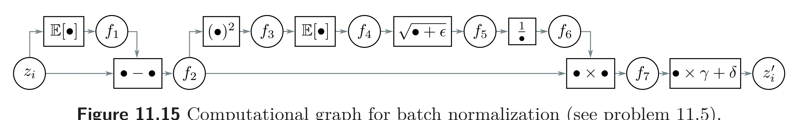

  

  <strong>Figure 11.15</strong> Computational graph for batch normalization (see problem 11.5).

Problem 11.4* Explain why the values in the two branches of the residual blocks in figure 11.6a are uncorrelated. Show that the variance of the sum of uncorrelated variables is the sum of their individual variances.

Problem 11.5* The forward pass for batch normalization given a batch of scalar values $\lbrace z\_{i}\rbrace\_{i=1}^{I}$ consists of the following operations (figure 11.15):

$$
\begin{aligned}
f_1 &= \mathbb{E}[z_i] & f_5 &= \sqrt{f_4+\epsilon} \\
f_{2i} &= z_i-f_1 & f_6 &= 1/f_5 \\
f_{3i} &= f_{2i}^{2} & f_{7i} &= f_{2i}\times f_6 \\
f_4 &= \mathbb{E}[f_{3i}] & z'_i &= f_{7i}\times\gamma+\delta
\end{aligned}\qquad (11.10)
$$

where E[ $z\_{i}$ ] = $\frac{1}{I}\sum\_{i}z\_{i}$ . Write Python code to implement the forward pass. Now derive the algorithm for the backward pass. Work backward through the computational graph computing the derivatives to generate a set of operations that computes $\partial z\_{i}^{\prime}/\partial z\_{i}$ for every element in the batch. Write Python code to implement the backward pass.

Problem 11.6 Consider a fully connected neural network with one input, one output, and ten hidden layers, each of which contains twenty hidden units. How many parameters does this network have? How many parameters will it have if we place a batch normalization operation between each linear transformation and ReLU?

Problem 11.7* Consider applying an L2 regularization penalty to the weights in the convolutional layers in figure 11.7a, but not to the scaling parameters of the subsequent BatchNorm layer. What do you expect will happen as training proceeds?

Problem 11.8 Consider a convolutional residual block that contains a batch normalization operation, followed by a ReLU activation function, and then a $3 \times 3$ convolutional layer. If the input and output both have 512 channels, how many parameters are needed to define this block? Now consider a bottleneck residual block that contains three batch normalization/ReLU/convolution sequences. The first uses a $1 \times 1$ convolution to reduce the number of channels from 512 to 128. The second uses a $3 \times 3$ convolution with the same number of input and output channels. The third uses a $1 \times 1$ convolution to increase the number of channels from 128 to 512 (see figure 11.7b). How many parameters are needed to define this block?

Problem 11.9 The U-Net is completely convolutional and can be run with any sized image after training. Why do we not train with a collection of arbitrarily-sized images?
