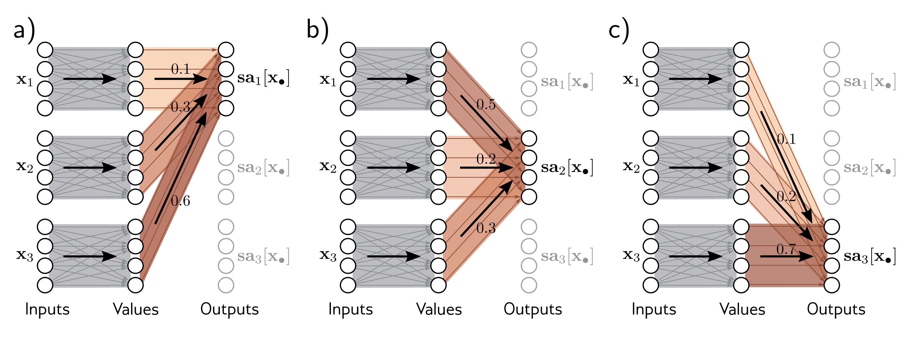

  

  <strong>Figure 12.1</strong> Self-attention as routing. The self-attention mechanism takes N inputs $\mathbf{x}_{1},\ldots,\mathbf{x}_{N}\in\mathbb{R}^{D}$ (here $N=3$ and $D=4$) and processes each separately to compute N values vectors. The $n^{th}$ output $\mathbf{s}_{a_{n}}[\mathbf{x}_{1},\ldots\mathbf{x}_{N}]$ (written as $\mathbf{s}_{a_{n}}[\mathbf{x}_{\bullet}]$ for short) is then computed as a weighted sum of the N values vectors, where the weights are positive and sum to one. a) Output $\mathbf{s}_{a_{1}}[\mathbf{x}_{\bullet}]$ is computed as $a[\mathbf{x}_{1},\mathbf{x}_{1}]=0.1$ times the first value vector, $a[\mathbf{x}_{2},\mathbf{x}_{1}]=0.3$ times the second value vector, and $a[\mathbf{x}_{3},\mathbf{x}_{1}]=0.6$ times the third value vector. b) Output $\mathbf{s}_{a_{2}}[\mathbf{x}_{\bullet}]$ is computed in the same way, but this time with weights of 0.5, 0.2, and 0.3. c) The weighting for output $\mathbf{s}_{a_{3}}[\mathbf{x}_{\bullet}]$ is different again. Each output can hence be thought of as a different routing of the N values.

## 12.2.1 Computing and weighting values

Equation 12.2 shows that the same weights $\Omega_{v} \in \mathbb{R}^{D \times D}$ and biases $\boldsymbol{\beta}_{v} \in \mathbb{R}^{D}$ are applied to each input $x_{\bullet} \in \mathbb{R}^{D}$. This computation scales linearly with the sequence length $N$, so it needs fewer parameters than a fully connected network relating all DN inputs to all DN values. In fact, the value computation can be viewed as a sparse matrix operation with shared parameters that relates these DN quantities (figure 12.2b).

The attention weights $a[x_{m}, x_{n}]$ combine the values from different inputs. They are also sparse since there is only one weight for each ordered pair of inputs $(x_{m}, x_{n})$ , regardless of the size of these inputs (figure 12.2c). It follows that the number of attention weights has a quadratic dependence on the sequence length N, but is independent of the length D of each input.

## 12.2.2 Computing attention weights

In the previous section, we saw that the outputs result from two chained linear transformations; the value vectors $\beta_{v} + \Omega_{v}x_{m}$ are computed independently for each input $x_{m}$ , and these vectors are combined linearly by the attention weights $a[x_{m}, x_{n}]$ . However, the overall self-attention computation is nonlinear. As we’ll see shortly, the attention weights are themselves nonlinear functions of the input. This is an example of a hypernetwork, where one network branch computes the weights of another. To compute the
