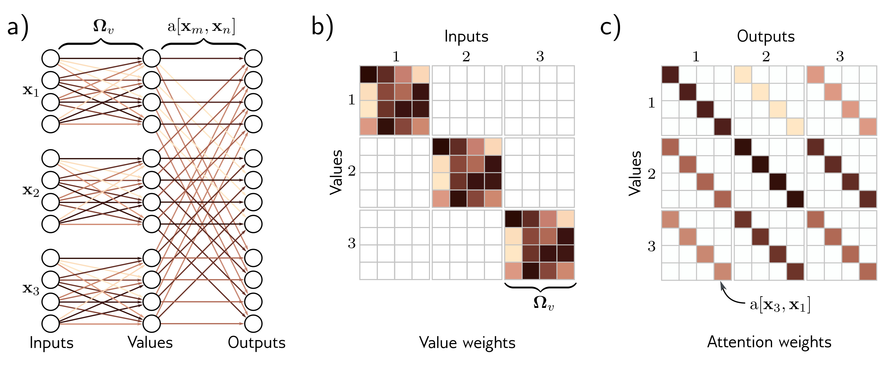

b)

c)

**Figure 3**

  

  <strong>Figure 12.2</strong> Self-attention for N=3 inputs $\mathbf{x}_{n}$, each with dimension $D=4$. a) Each input $\mathbf{x}_{m}$ is operated on independently by the same weights $\Omega_{v}$ (same color equals same weight) and biases $\beta_{v}$ (not shown) to form the values $\boldsymbol{\beta}_{v} + \Omega_{v}\mathbf{x}_{m}$. Each output is a linear combination of the values, with the attention weight $\mathrm{a}[\mathbf{x}_{m}, \mathbf{x}_{n}]$ defining the contribution of the $m^{th}$ value to the $n^{th}$ output. b) Matrix showing block sparsity of linear transformation $\Omega_{v}$ between inputs and values. c) Matrix showing sparsity of attention weights relating values and outputs.

attention, we apply two more linear transformations to the inputs:

$$
\begin{array}{rcl}\mathbf{q}_{n}&=&\beta_{q}+\Omega_{q}\mathbf{x}_{n}\\ \mathbf{k}_{m}&=&\beta_{k}+\Omega_{k}\mathbf{x}_{m},\end{array} \quad (12.4)
$$

where $\lbrace q_{n}\rbrace $ and $\lbrace \mathbf{k}_{m}\rbrace $ are termed queries and keys, respectively. Then we compute dot products between the queries and keys and pass the results through a softmax function:

$$
\begin{array}{rcl}a[\mathbf{x}_{m},\mathbf{x}_{n}]&=&\mathrm{softmax}_{m}\left[\mathbf{k}_{\bullet}^{T}\mathbf{q}_{n}\right]\\&=&\frac{\exp\left[\mathbf{k}_{m}^{T}\mathbf{q}_{n}\right]}{\sum_{m^{\prime}=1}^{N}\exp\left[\mathbf{k}_{m^{\prime}}^{T}\mathbf{q}_{n}\right]},\end{array} \quad (12.5)
$$

so for each $\mathbf{x}_{n}$, they are positive and sum to one (figure 12.3). For obvious reasons, this is known as dot-product self-attention.

The names “queries” and “keys” were inherited from the field of information retrieval and have the following interpretation: the dot product operation returns a measure of similarity between its inputs, so the weights  $a[x_{\bullet}, x_{n}]$  depend on the relative similarities between the  $n^{th}$  query and all of the keys. The softmax function means that the key vectors “compute” with one another to contribute to the final result. The queries and keys must have the same dimensions. However, these can differ from the dimension of
