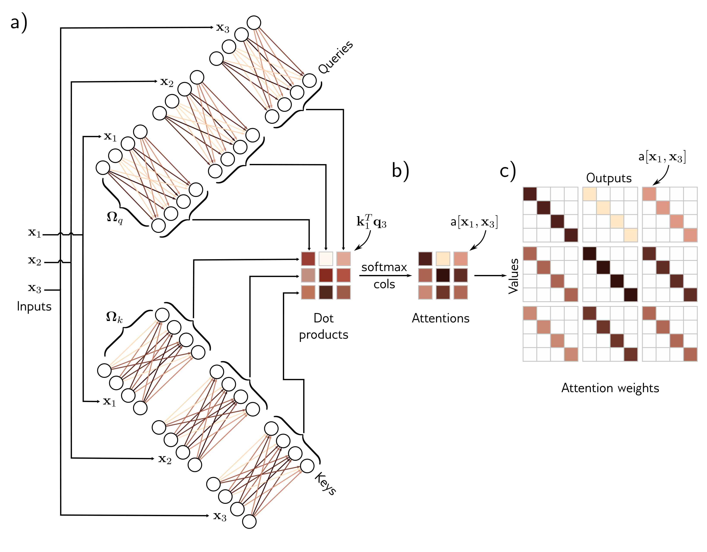

  

  <strong>Figure 12.3</strong> Computing attention weights. a) Query vectors $\mathbf{q}\_{n} = \boldsymbol{\beta}\_{q} + \boldsymbol{\Omega}\_{q}\mathbf{x}\_{n}$ and key vectors $\mathbf{k}\_{n} = \boldsymbol{\beta}\_{k} + \boldsymbol{\Omega}\_{k}\mathbf{x}\_{n}$ are computed for each input $\mathbf{x}\_{n}$. b) The dot products between each query and the three keys are passed through a softmax function to form non-negative attentions that sum to one. c) These route the value vectors (figure 12.1) via the sparse matrix from figure 12.2c.

the values, which is usually the same size as the input, so the representation doesn’t change size.

## 12.2.3 Self-attention summary

The $n^{th}$ output is a weighted sum of the same linear transformation $v\_{*} = \beta\_{v} + \Omega\_{v}x\_{*}$ . applied to all of the inputs, where these attention weights are positive and sum to one. The weights depend on a measure of similarity between input $x\_{n}$ and the other inputs. There is no activation function, but the mechanism is nonlinear due to the dot-product and a softmax operation used to compute the attention weights.

Note that this mechanism fulfills the initial requirements. First, there is a single shared set of parameters $\phi = \lbrace B\_{v}, \Omega\_{v}, B\_{q}, \Omega\_{q}, B\_{k}, \Omega\_{k}\rbrace$ . This is independent of the
