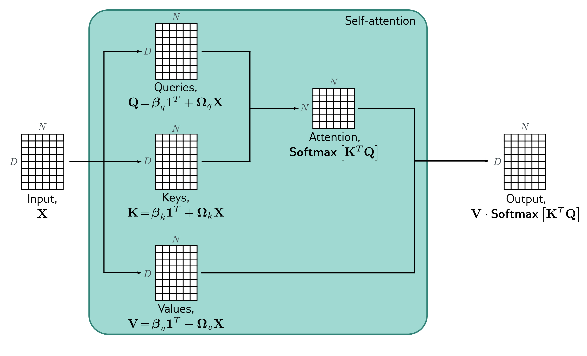

  

  <strong>Figure 12.4</strong> Self-attention in matrix form. Self-attention can be implemented efficiently if we store the N input vectors $x\_{n}$ in the columns of the D×N matrix X. The input X is operated on separately by the query matrix Q, key matrix K, and value matrix V. The dot products are then computed using matrix multiplication, and a softmax operation is applied independently to each column of the resulting matrix to calculate the attentions. Finally, the values are post-multiplied by the attentions to create an output of the same size as the input.

number of inputs N, so the network can be applied to different sequence lengths. Second, there are connections between the inputs (words), and the strength of these connections depends on the inputs themselves via the attention weights.

## 12.2.4 Matrix form

The above computation can be written in a compact form if the N inputs $x\_{n}$ form the columns of the $D \times N$ matrix X. The values, queries, and keys can be computed as:

$$
\begin{aligned}
\mathbf{V}[\mathbf{X}] &= \boldsymbol{\beta}_v\mathbf{1}^{T}+\boldsymbol{\Omega}_v\mathbf{X} \\
\mathbf{Q}[\mathbf{X}] &= \boldsymbol{\beta}_q\mathbf{1}^{T}+\boldsymbol{\Omega}_q\mathbf{X} \\
\mathbf{K}[\mathbf{X}] &= \boldsymbol{\beta}_k\mathbf{1}^{T}+\boldsymbol{\Omega}_k\mathbf{X}
\end{aligned}\qquad (12.6)
$$

where 1 is an $N \times 1$ vector containing ones. The self-attention computation is then:

$$
\mathbf{Sa}[\mathbf{X}]=\mathbf{V}[\mathbf{X}]\cdot\mathrm{softmax}\left[\mathbf{K}[\mathbf{X}]^{T}\mathbf{Q}[\mathbf{X}]\right]\qquad (12.7)
$$
