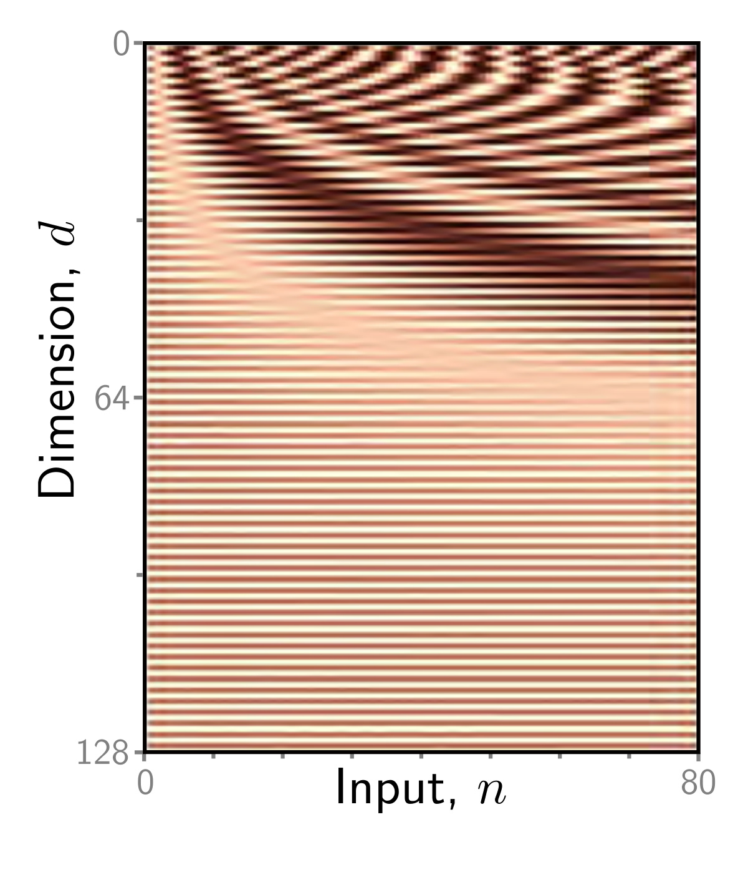

**Figure 1**

  

  <strong>Figure 12.5</strong> Positional encodings. The self-attention architecture is equivariant to permutations of the inputs. To ensure that inputs at different positions are treated differently, a positional encoding matrix  $\Pi$  can be added to the data matrix. Each column is different, so the positions can be distinguished. Here, the position encodings use a predefined procedural sinusoidal pattern (which can be extended to larger values of N if necessary). However, in other cases, they are learned.

where the function Softmax[●] takes a matrix and performs the softmax operation independently on each of its columns (figure 12.4). In this formulation, we have explicitly included the dependence of the values, queries, and keys on the input X to emphasize that self-attention computes a kind of triple product based on the inputs. However, from now on, we will drop this dependence and just write:

$$
\mathbf{S a}[\mathbf{X}]=\mathbf{V}\cdot\mathbf{S o f t m a x}\Big[\mathbf{K}^{T}\mathbf{Q}\Big]. \quad (12.8)
$$

## 12.3 Extensions to dot-product self-attention

In the previous section, we described self-attention. Here, we introduce three extensions that are almost always used in practice.

## 12.3.1 Positional encoding

Observant readers will have noticed that the self-attention mechanism overlooks important information: the computation does not take into account the order of the inputs  $x_{n}$ . More precisely, it is equivariant with respect to input permutations. However, order is important when the inputs correspond to the words in a sentence. The sentence  $\theta$  is a woman at the raccoon has a different meaning than  $\theta$ . There are two main approaches to incorporating position information.

Absolute positional encodings: A matrix  $\Pi$  is added to the input X that encodes positional information (figure 12.5). Each column of  $\Pi$  is unique and hence contains information about the absolute position in the input sequence. This matrix can be chosen by hand or learned. It may be added to the network inputs or at every network layer. Sometimes it is added to X in the computation of the queries and keys but not to the values.

Problem 12.3
