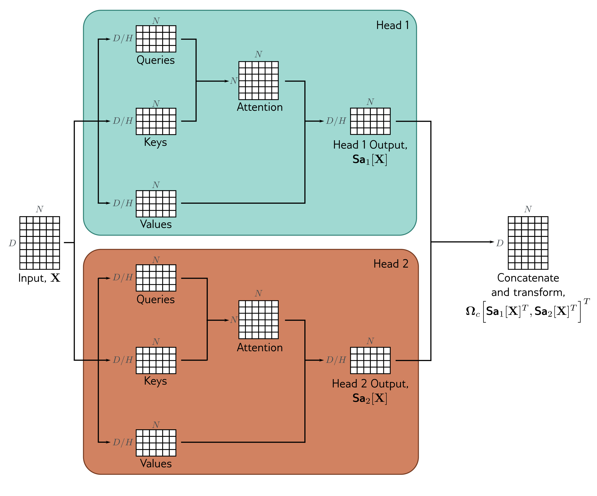

  

  <strong>Figure 12.6</strong> Multi-head self-attention. Self-attention occurs in parallel across multiple “heads.” Each has its own queries, keys, and values. Here two heads are depicted, in the cyan and orange boxes, respectively. The outputs are vertically concatenated, and another linear transformation $\Omega_{c}$ is used to recombine them.

$$
\mathbf{MhSa}[\mathbf{X}]=\boldsymbol{\Omega}_c\left[\mathbf{Sa}_1[\mathbf{X}]^{T},\mathbf{Sa}_2[\mathbf{X}]^{T},\ldots,\mathbf{Sa}_H[\mathbf{X}]^{T}\right]^{T}\qquad (12.12)
$$

Multiple heads seem to be necessary to make self-attention work well. It has been speculated that they make the self-attention network more robust to bad initializations.

(12.12)

## 12.4 Transformer layers

Self-attention is just one part of a larger transformer layer. This consists of a multi-head self-attention unit (which allows the word representations to interact with each
