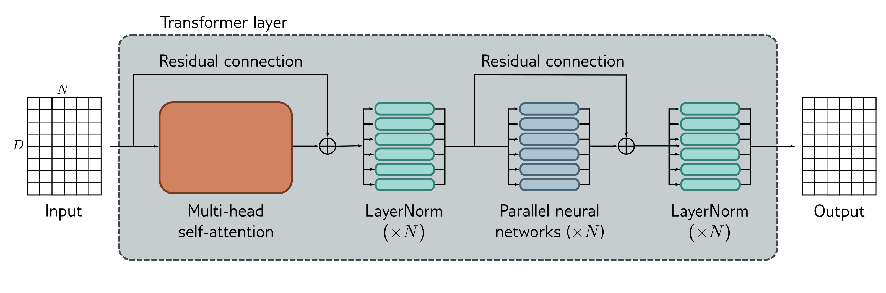

  

  <strong>Figure 12.7</strong> Transformer layer. The input consists of a $D \times N$ matrix containing the D-dimensional word embeddings for each of the N input tokens. The output is a matrix of the same size. The transformer layer consists of a series of operations. First, there is a multi-head attention block, allowing the word embeddings to interact with one another. This forms the processing of a residual block, so the inputs are added back to the output. Second, a LayerNorm operation is applied separately to each embedding. Third, there is a second residual layer where the same fully connected neural network is applied separately to each of the N word representations (columns). Finally, LayerNorm is applied again.

other) followed by a fully connected network mlp[x₀] (that operates separately on each word). Both units are residual networks (i.e., their output is added back to the original input). In addition, it is typical to add a LayerNorm operation after both the self-attention and fully connected networks. This is similar to BatchNorm but normalizes each embedding in each batch element separately using statistics calculated across its D embedding dimensions (section 11.4 and figure 11.14). The complete layer can be described by the following series of operations (figure 12.7):

$$
\begin{aligned}
\mathbf{X} &\leftarrow \mathbf{X}+\mathrm{MhSa}[\mathbf{X}] \\
\mathbf{X} &\leftarrow \mathrm{LayerNorm}[\mathbf{X}] \\
\mathbf{x}_n &\leftarrow \mathbf{x}_n+\mathrm{mlp}[\mathbf{x}_n] && \forall n\in\lbrace 1,\ldots,N\rbrace \\
\mathbf{X} &\leftarrow \mathrm{LayerNorm}[\mathbf{X}]
\end{aligned}\qquad (12.13)
$$

where the column vectors $x\_{n}$ are separately taken from the full data matrix X. In a real network, the data passes through a series of these transformer layers.

## 12.5 Transformers for natural language processing

The previous section described the transformer layer. This section describes how it is used in natural language processing (NLP) tasks. A typical NLP pipeline starts with a tokenizer that splits the text into words or word fragments. Then each of these tokens
