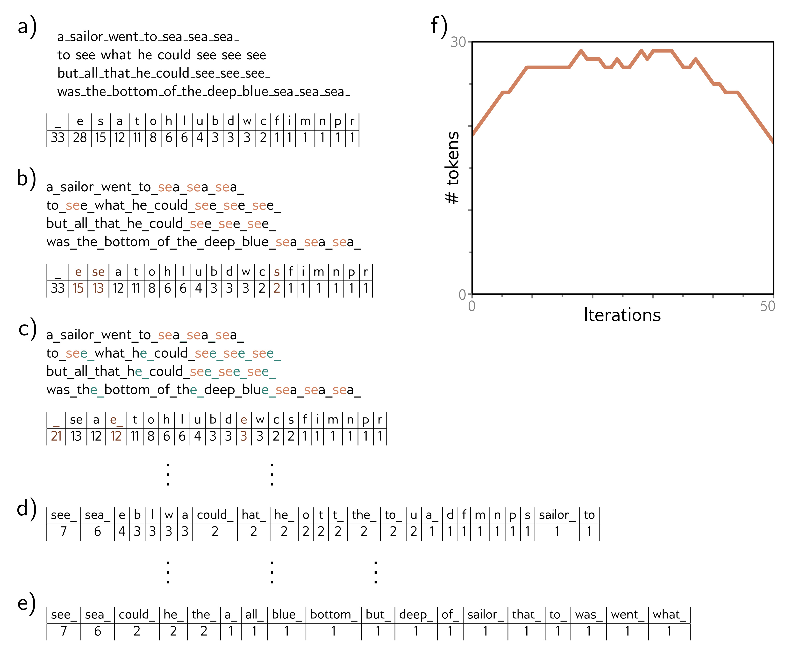

**Figure 1**

  

  <strong>Figure 12.8</strong> Sub-word tokenization. a) A passage of text from a nursery rhyme. The tokens are initially just the characters and whitespace (represented by an underscore), and their frequencies are displayed in the table. b) At each iteration, the sub-word tokenizer looks for the most commonly occurring adjacent pair of tokens (in this case, se) and merges them. This creates a new token and decreases the counts for the original tokens s and e. Note that the last character of the first token to be merged cannot be whitespace, which prevents merging across words. c) At the second iteration, the algorithm merges e and the whitespace character ___. d) After 23 iterations, the tokens consist of a mix of letters, word fragments, and commonly occurring words. e) If we continue this process indefinitely, the tokens eventually represent the full words. f) Over time, the number of tokens increases as we add word fragments to the letters and then decreases again as we merge these fragments. In a real situation, there would be a very large number of words, and the algorithm would terminate when the vocabulary size (number of tokens) reached a predetermined value. Punctuation and capital letters would also be treated as separate input characters.

Draft: please send errata to udlbookmail@gmail.com.
