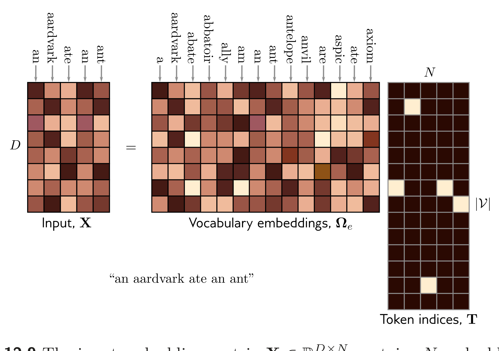

  

  <strong>Figure 12.9</strong> The input embedding matrix $\mathbf{X} \in \mathbb{R}^{D \times N}$ contains $N$ embeddings of length $D$ and is created by multiplying a matrix $\mathbf{\Omega}\_{e}$ containing the embeddings for the entire vocabulary with a matrix containing one-hot vectors in its columns that correspond to the word or sub-word indices. The vocabulary matrix $\mathbf{\Omega}\_{e}$ is considered a parameter of the model and is learned along with the other parameters. Note that the two embeddings for the word an in $\mathbf{X}$ are the same.

text. Encoder-decoders are used in sequence-to-sequence tasks, where one text string is converted into another (e.g., machine translation). These variations are described in sections 12.6–12.8, respectively.

## 12.6 Encoder model example: BERT

BERT is an encoder model that uses a vocabulary of 30,000 tokens. Input tokens are converted to 1024-dimensional word embeddings and passed through 24 transformer layers. Each contains a self-attention mechanism with 16 heads. The queries, keys, and values for each head are of dimension 64 (i.e., the matrices $\Omega\_{vh}, \Omega\_{qh}, \Omega\_{kh}$ are $64 \times 1024$ ). The dimension of the single hidden layer in the fully connected networks is 4096. The total number of parameters is $\sim$ 340 million. When BERT was introduced, this was considered large, but it is now much smaller than state-of-the-art models.

Encoder models like BERT exploit transfer learning (section 9.3.6). During pre-training, the parameters of the transformer architecture are learned using self-supervision from a large corpus of text. The goal here is for the model to learn general information about the statistics of language. In the fine-tuning stage, the resulting network is adapted to solve a particular task using a smaller body of labelled training data.
