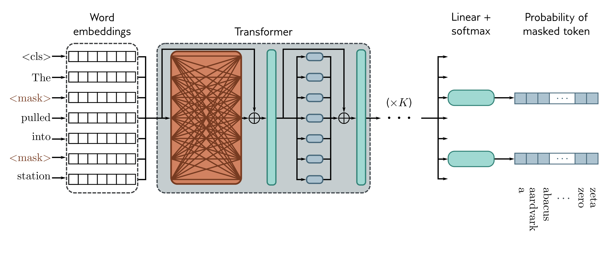

  

  <strong>Figure 12.10</strong> Pre-training for BERT-like encoder. The input tokens (and a special <cls> token denoting the start of the sequence) are converted to word embeddings. Here, these are represented as rows rather than columns, so the box labeled “word embeddings” is $X^{T}$ . These embeddings are passed through a series of transformer layers (orange connections indicate that every token attends to every other token in these layers) to create a set of output embeddings. A small fraction of the input tokens are randomly replaced with a generic <mask> token. In pre-training, the goal is to predict the missing word but has the disadvantage that it does not make efficient use of data; here, seven tokens need to be processed to add two terms to the loss function.

## 12.6.1 Pre-training

In the pre-training stage, the network is trained using self-supervision. This allows the use of enormous amounts of data without the need for manual labels. For BERT, the self-supervision task consists of predicting missing words from sentences from a large internet corpus (figure 12.10). [^1] During training, the maximum input length is 512 tokens, and the batch size is 256. The system is trained for a million steps, corresponding to roughly 50 epochs of the 3.3-billion word corpus.

Predicting missing words forces the transformer network to understand some syntax. For example, it might learn that the adjective red is often found before nouns like house or car but never before a verb like shout. It also allows the model to learn superficial common sense about the world. For example, after training, the model will assign a higher probability to the missing word train in the sentence The <mask> pulled into the station than it would to the word peanut. However, the degree of “understanding” this type of model can ever have is limited.

[^1] BERT also uses a secondary task that predicts whether two sentences were originally adjacent in the text or not, but this only marginally improves performance.
