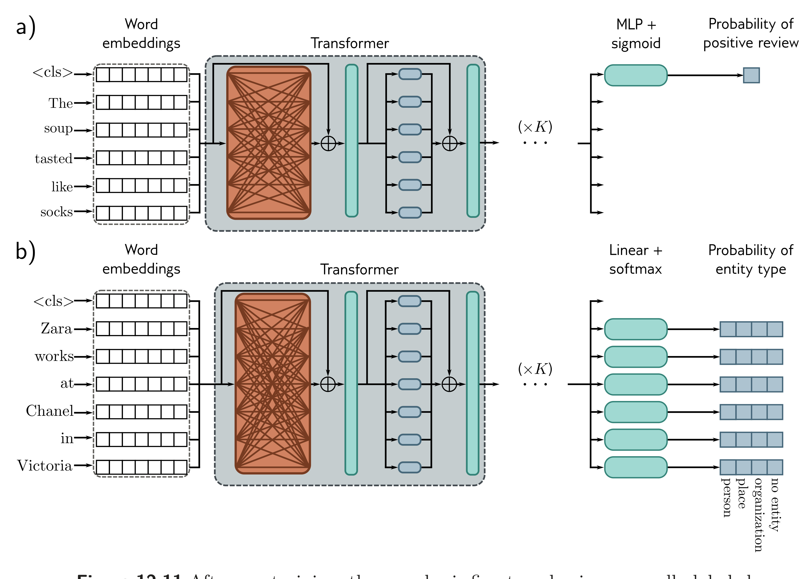

  

  <strong>Figure 12.11</strong> After pre-training, the encoder is fine-tuned using manually labeled data to solve a particular task. Usually, a linear transformation or a multi-layer perceptron (MLP) is appended to the encoder to produce whatever output is required. a) Example text classification task. In this sentiment classification task, the <cls> token embedding is used to predict the probability that the review is positive. b) Example word classification task. In this named entity recognition problem, the embedding for each word is used to predict whether the word corresponds to a person, place, or organization, or is not an entity.

## 12.6.2 Fine-tuning

In the fine-tuning stage, the model parameters are adjusted to specialize the network to a particular task. An extra layer is appended onto the transformer network to convert the output vectors to the desired output format. Examples include:

Text classification: In BERT, a special token known as the classification or <cls> token is placed at the start of each string during pre-training. For text classification tasks like sentiment analysis (in which the passage is labeled as having a positive or negative emotional tone), the vector associated with the <cls> token is mapped to a single number and passed through a logistic sigmoid (figure 12.11a). This contributes to a standard binary cross-entropy loss (section 5.4).
