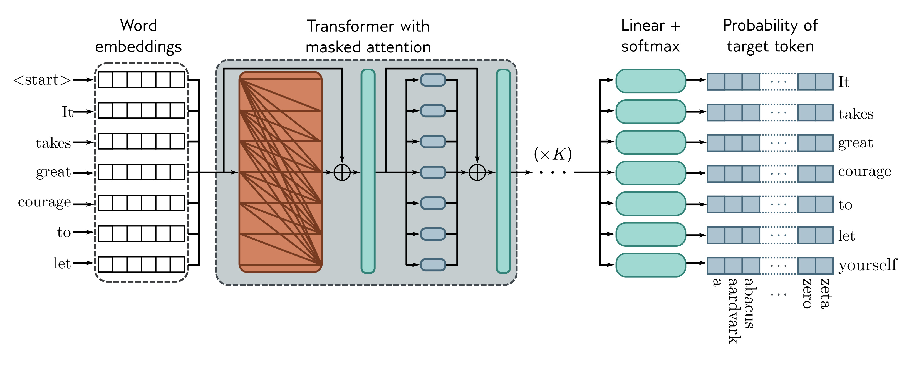

  

  <strong>Figure 12.12</strong> Training GPT3-type decoder network. The tokens are mapped to word embeddings with a special &lt;start&gt; token at the beginning of the sequence. The embeddings are passed through a series of transformer layers that use masked self-attention. Here, each position in the sentence can only attend to its own embedding and those of tokens earlier in the sequence (orange connections). The goal at each position is to maximize the probability of the following ground truth token in the sequence. In other words, at position one, we want to maximize the probability of the token It; at position two, we want to maximize the probability of the token takes; and so on. Masked self-attention ensures the system cannot cheat by looking at subsequent inputs. The autoregressive task has the advantage of making efficient use of the data since every word contributes a term to the loss function. However, it only exploits the left context of each word.

token. By repeating this process, we can generate large bodies of text. The computation can be made quite efficient as prior embeddings do not depend on subsequent ones due to the masked self-attention. Hence, much of the earlier computation can be recycled as we generate subsequent tokens.

In practice, many strategies can make the output text more coherent. For example, beam search keeps track of multiple possible sentence completions to find the overall most likely sequence of words (which is not necessarily found by greedily choosing the most likely word at each step). Top-k sampling randomly draws the next word from only the top-K most likely possibilities to prevent the system from accidentally choosing from the long tail of low-probability tokens and leading to an unnecessary linguistic dead end.

## 12.7.4 GPT3 and few-shot learning

Large language models like GPT3 apply these ideas on a massive scale. In GPT3, the sequence lengths are 2048 tokens long, and the total batch size is 3.2 million tokens. There are 96 transformer layers (some of which implement a sparse version of attention), each processing a word embedding of size 12288. There are 96 heads in the self-attention
