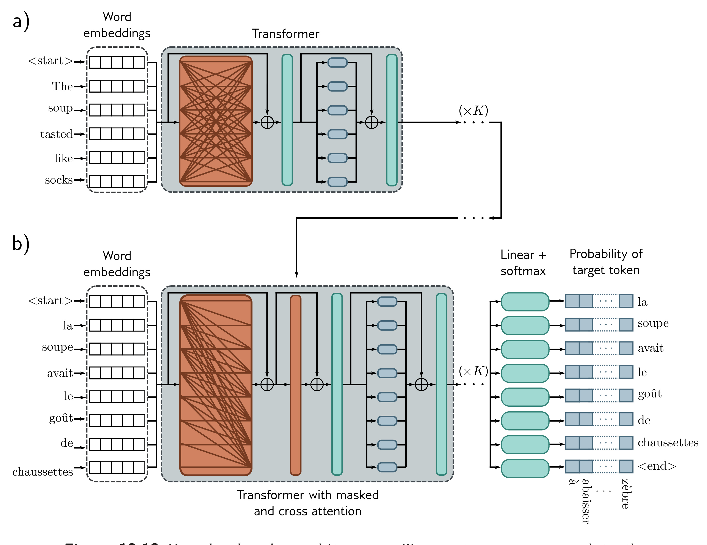

  

  <strong>Figure 12.13</strong> Encoder-decoder architecture. Two sentences are passed to the system with the goal of translating the first into the second. a) The first sentence is passed through a standard encoder. b) The second sentence is passed through a decoder that uses masked self-attention but also attends to the output embeddings of the encoder using cross-attention (orange rectangle). The loss function is the same as for the decoder model; we want to maximize the probability of the next word in the output sequence.

## 12.8 Encoder-decoder model example: machine translation

Translation between languages is an example of a sequence-to-sequence task. One common approach uses both an encoder (to compute a good representation of the source sentence) and a decoder (to generate the sentence in the target language). This is aptly called an encoder-decoder model.

Consider translating from English to French. The encoder receives the sentence in English and processes it through a series of transformer layers to create an output representation for each token. During training, the decoder receives the ground truth translation in French and passes it through a series of transformer layers that use masked self-attention and predict the following word at each position. However, the decoder layers also attend to the output of the encoder. Consequently, each French output word is
