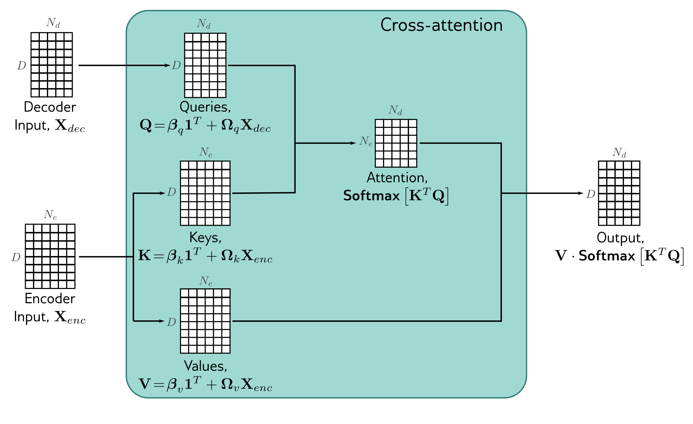

  

  <strong>Figure 12.14</strong> Cross-attention. The flow of computation is the same as in standard self-attention, but the queries are calculated from the decoder embeddings $X_{dec}$ , and the keys and values from the encoder embeddings $X_{enc}$ . For translation tasks, the encoder contains information about the source language statistics, and the decoder contains information about the target language statistics.

conditioned on the previous output words and the source English sentence (figure 12.13).

This is achieved by modifying the transformer layers in the decoder. Originally, these consisted of a masked self-attention layer followed by a neural network applied individually to each embedding (figure 12.12). A new self-attention layer is added between these two components, in which the decoder embeddings attend to the encoder embeddings. This uses a version of self-attention known as encoder-decoder attention or cross-attention, where the queries are computed from the decoder embeddings and the keys and values from the encoder embeddings (figure 12.14).

## 12.9 Transformers for long sequences

Since each token in a transformer encoder model interacts with every other token, the computational complexity scales quadratically with the length of the sequence. For a decoder model, each token only interacts with previous tokens, so there are roughly half the number of interactions, but the complexity still scales quadratically. These relationships can be visualized as interaction matrices (figure 12.15a–b).

This quadratic increase in the amount of computation ultimately limits the length of sequences that can be used. Many methods have been developed to extend the trans-
