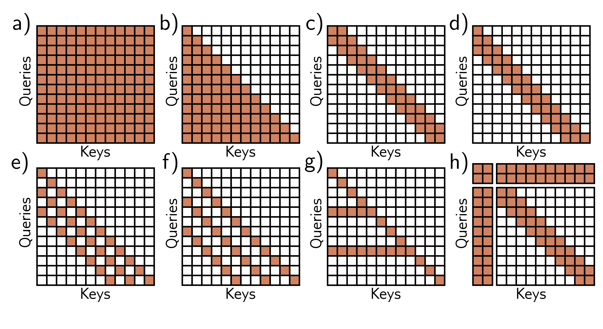

  

  <strong>Figure 12.15</strong> Interaction matrices for self-attention. a) In an encoder, every token interacts with every other token, and computation expands quadratically with the number of tokens. b) In a decoder, each token only interacts with the previous tokens, but complexity is still quadratic. c) Complexity can be reduced by using a convolutional structure (encoder case). d) Convolutional structure for decoder case. e–f) Convolutional structure with dilation rate of two and three (decoder case). g) Another strategy is to allow selected tokens to interact with all the larger distances as the receptive field expands. As for convolution in images, the kernel rows). These interact with all of the tokens as well as with each other.

former to cope with longer sequences. One approach is to prune the self-attention interactions or, equivalently, to sparsify the interaction matrix (figures 12.15c-h). For example, this can be restricted to a convolutional structure so that each token only interacts with a few neighboring tokens. Across multiple layers, tokens still interact at larger distances as the receptive field expands. As for convolution in images, the kernel can vary in size and dilation rate.

A pure convolutional approach requires many layers to integrate information over large distances. One way to speed up this process is to allow certain tokens (perhaps at the start of every sentence) to attend to all other tokens (encoder model) or all previous tokens (decoder model). A similar idea is to have a small number of global tokens that connect to all the other tokens and themselves. Like the <cls> token, these do not represent any word but serve to provide long-distance connections.

## 12.10 Transformers for images

Transformers were initially developed for text data. Their enormous success in this area led to experimentation on images. This was not obviously a promising idea for two
