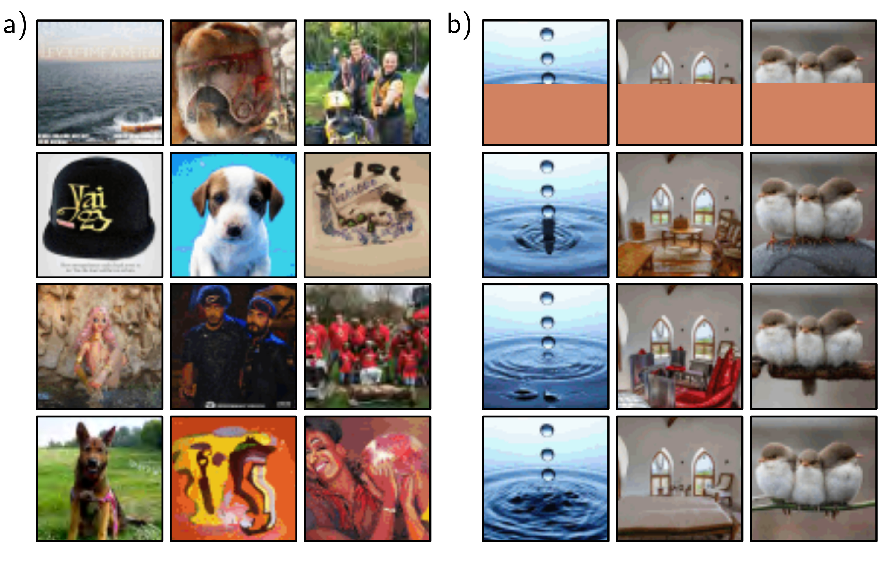

  

  <strong>Figure 12.16</strong> ImageGPT. a) Images generated from the autoregressive ImageGPT model. The top-left pixel is drawn from the estimated empirical distribution at this position. Subsequent pixels are generated in turn, conditioned on the previous ones, working along the rows until the bottom-right of the image is reached. For each pixel, the transformer decoder generates a conditional distribution as in equation 12.15, and a sample is drawn. The extended sequence is then fed back into the network to generate the next pixel, and so on. b) Image completion. In each case, the lower half of the image is removed (top row), and ImageGPT completes the remaining part pixel by pixel (three different completions shown). Adapted from https://openai.com/blog/image-gpt/.

final layer with one that maps to the desired number of classes and is fine-tuned.

For the ImageNet benchmark, this system achieved an 11.45% top-1 error rate. However, it did not perform as well as the best contemporary convolutional networks without supervised pre-training. The strong inductive bias of convolutional networks can only be superseded by employing extremely large amounts of training data.

## 12.10.3 Multi-scale vision transformers

The Vision Transformer differs from convolutional architectures in that it operates on a single scale and has a receptive field that covers the whole image. Several transformer models that process the image at multiple scales have been proposed. Similarly to convolutional networks, these generally start with small high resolution patches and few channels and gradually enlarge the receptive field, decrease the spatial resolution and
