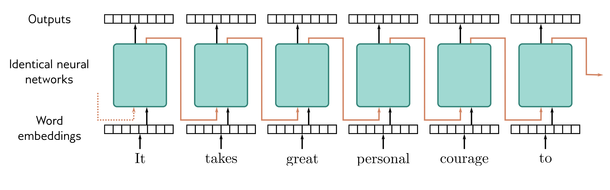

  

  <strong>Figure 12.19</strong> Recurrent neural networks (RNNs). The word embeddings are passed sequentially through a series of identical neural networks. Each network has two outputs; one is the output embedding, and the other (orange arrows) feeds back into the next neural network, along with the next word embedding. Each output embedding contains information about the word itself and its context in the preceding sentence fragment. In principle, the final output contains information about the entire sentence and could be used to support classification tasks similarly to the <cls> token in a transformer encoder model. However, RNNs sometimes gradually “forget” about tokens that are further back in time.

entity recognition (people, places, companies, etc.), text summarization, question answering, word sense disambiguation, and document clustering. NLP was initially tackled by rule-based methods that exploited the structure and statistics of grammar. See Manning & Schutze (1999) and Jurafsky & Martin (2000) for early approaches.

Recurrent neural networks: Before the introduction of transformers, many state-of-the-art NLP applications used recurrent neural networks, or RNNs for short (figure 12.19). The term “recurrent” was introduced by Rumelhart et al. (1985), but the main idea dates to at least Minsky & Papert (1969). RNNs ingest a sequence of inputs (words in NLP) one at a time. At each step, the network receives both the new input and a hidden representation computed from the previous time step (the recurrent connection). The final output contains information about the whole input. This representation can then support NLP tasks like classification or translation. They have also been used in a decoding context in which generated tokens are fed back into the model to form the next input to the sequence. For example, the PixelRNN (Van den Oord et al., 2016c) used RNNs to build an autoregressive model of images.

From RNNs to transformers: One of the problems with RNNs is that they can forget information that is further back in the sequence. More sophisticated versions of this architecture, such as long short-term memory networks or LSTMs (Hochreiter & Schmidhuber, 1997b) and self-attention), output tokens attend to those earlier in the sequence (masked self-attention), and output tokens also attend to the input tokens (cross-attention). A formal algorithmic description of the transformer can be found in Phuong & Hutter (2022), and a survey of work can be found in Lin et al. (2022). The literature should be approached with caution, as many en-
