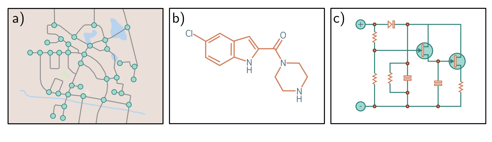

  

  <strong>Figure 13.1</strong> Real-world graphs. Some objects, such as a) road networks, b) molecules, and c) electrical circuits, are naturally structured as graphs.

- Social networks are graphs where nodes are people, and the edges represent friends between them.

- The scientific literature can be viewed as a graph where the nodes are papers, and the edges represent citations.

- Wikipedia can be considered a graph where the nodes are articles, and the edges represent hyperlinks between articles.

- Computer programs can be represented as graphs where the nodes are syntax tokens (variables at different points in the program flow), and the edges represent computations involving these variables.

- Geometric point clouds can be represented as graphs. Here, each point is a node with edges connecting to other nearby points.

- Protein interactions in a cell can be expressed as graphs, where the nodes are the proteins, and there is an edge between two proteins if they interact.

In addition, a set (an unordered list) can be treated as a graph in which every member is a node and connects to every other. An image can be treated as a graph with regular topology, in which each pixel is a node with edges to the adjacent pixels.

## 13.1.1 Types of graphs

Graphs can be categorized in various ways. The social network in figure 13.2a contains undirected edges; each pair of individuals with a connection between them have mutually agreed to be friends, so there is no sense that the relationship is directional. In contrast, the citation network in figure 13.2b contains directed edges. Each paper cites other papers, and this relationship is inherently one-way.

Figure 13.2c depicts a knowledge graph that encodes a set of facts about objects by defining relations between them. Technically, this is a directed heterogeneous multigraph. It is heterogeneous because the nodes can represent different types of entities (e.g., people, countries, companies). It is a multigraph because there can be multiple edges of different types between any two nodes.
