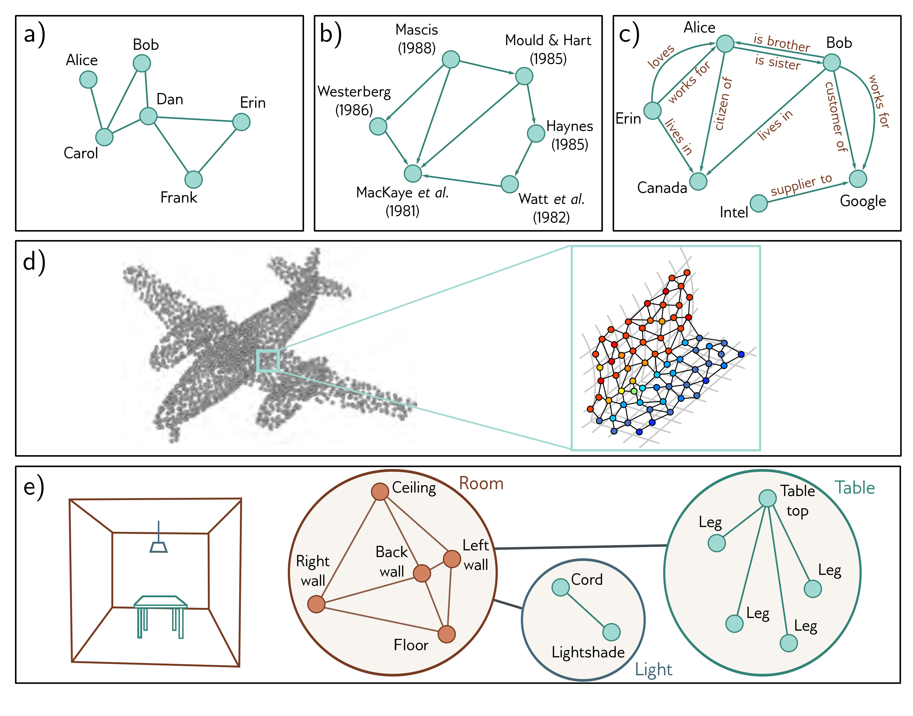

  

  <strong>Figure 13.2</strong> Types of graphs. a) A social network is an undirected graph; the connections between people are symmetric. b) A citation network is a directed graph; one publication cites another, so the relationship is asymmetric. c) A knowledge graph is a directed heterogeneous multigraph. The nodes are heterogeneous in that they represent different object types (people, places, companies) and multiple edges may represent different relations between each node. d) A point set can be converted to a graph by forming edges between nearby points. Each node has an associated position in 3D space, and this is termed a geometric graph (adapted from Hu et al., 2022). e) The scene on the left can be represented by a hierarchical graph. The topology of the room, table, and light are all represented by graphs. These graphs form nodes in a larger graph representing object adjacency (adapted from Fernández-Madrigal & González, 2002).

