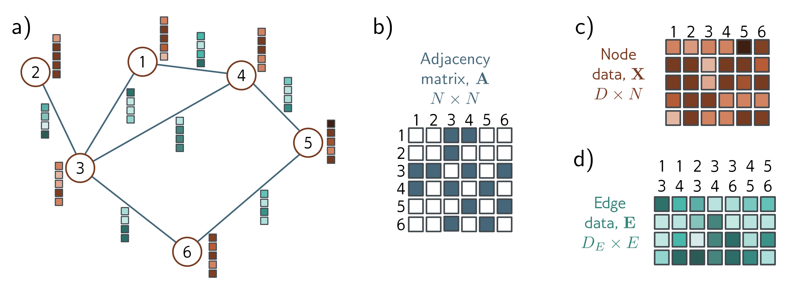

13.2 Graph representation

b)

c)

d)

  

  <strong>Figure 13.3</strong> Graph representation. a) Example graph with six nodes and seven edges. Each node has an associated embedding of length five (brown vectors). Each edge has an associated embedding of length four (blue vectors). This graph can be represented by three matrices. b) The adjacency matrix is a binary matrix where element  $(m, n)$  is set to one if node m connects to node n. c) The node data matrix X contains the concatenated node embeddings. d) The edge data matrix E contains the edge embeddings.

The point set representing the airplane in figure 13.2d can be converted into a graph by connecting each point to its K nearest neighbors. The result is a geometric graph where each point is associated with a position in 3D space. Figure 13.2e represents a hierarchical graph. The table, light, and room are each described by graphs representing the adjacency of their respective components. These three graphs are themselves nodes in another graph that represents the topology of the objects in a larger model.

All types of graphs can be processed using deep learning. However, this chapter focuses on undirected graphs like the social network in figure 13.2a.

## 13.2 Graph representation

In addition to the graph structure itself, information is typically associated with each node. For example, in a social network, each individual might be characterized by a fixed-length vector representing their interests. Sometimes, the edges also have information attached. For example, in a road network example, each edge might be characterized by its length, number of lanes, frequency of accidents, and speed limit. The information at a node is stored in a node embedding, and the information at an edge is stored in an edge embedding.

More formally, a graph consists of a set of N nodes connected by a set of E edges. The graph can be encoded by three matrices A, X, and E, representing the graph structure, node embeddings, and edge embeddings, respectively (figure 13.3).
