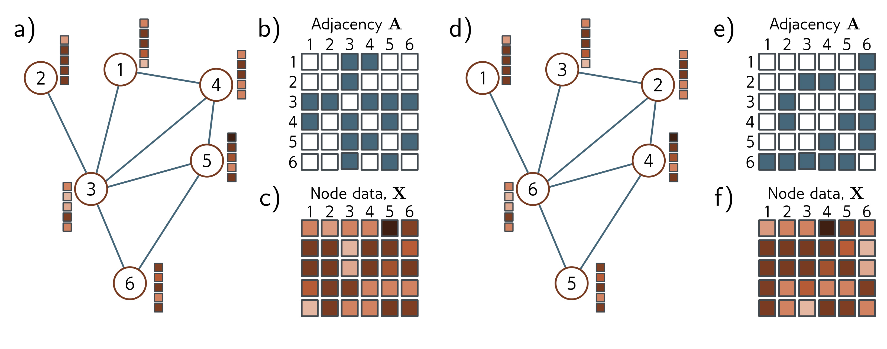

  

b)

c)

e)

f)

Figure 13.5 Permutation of node indices. a) Example graph, b) associated adjacency matrix and c) node embeddings. d) The same graph where the (arbitrary) order of the indices has been changed. e) The adjacency matrix and f) node matrix are now different. Consequently, any network layer that operates on the graph should be indifferent to the ordering of the nodes.

## 13.3.1 Tasks and loss functions

We defer discussion of graph neural network models until section 13.4 and first describe the types of problems these networks tackle and their associated loss functions. Supervised graph problems usually fall into one of three categories (figure 13.6).

Graph-level tasks: The network assigns a label or estimates one or more values from the entire graph, exploiting both the structure and node embeddings. For example, we might want to predict the temperature at which a molecule becomes liquid (a regression task) or whether a molecule is poisonous to human beings or not (a classification task).

For graph-level tasks, the output node embeddings are combined (e.g., by averaging), and the resulting vector is mapped via a linear transformation or neural network to a fixed-size vector. For regression, the mismatch between the result and the ground truth values is computed using the least squares loss. For binary classification, the output is passed through a sigmoid function, and the mismatch is calculated using the binary cross-entropy loss. Here, the probability that the graph belongs to class one might be given by:

$$
\begin{aligned}
Pr(y=1|\mathbf{X},\mathbf{A})=\mathrm{sig}\left[\beta_{K}+\boldsymbol{\omega}_{K}\mathbf{H}_{K}\mathbf{1}/N\right],
\end{aligned}
\tag{13.2}
$$

where the scalar  $\beta_{K}$  and  $1 \times D$  vector  $\omega_{K}$  are learned parameters. Post-multiplying the output embedding matrix  $H_{K}$  by the column vector 1 that contains ones has the effect of summing together all the embeddings and subsequently dividing by the number of nodes N computes the average. This is known as mean pooling (see figure 10.11).
