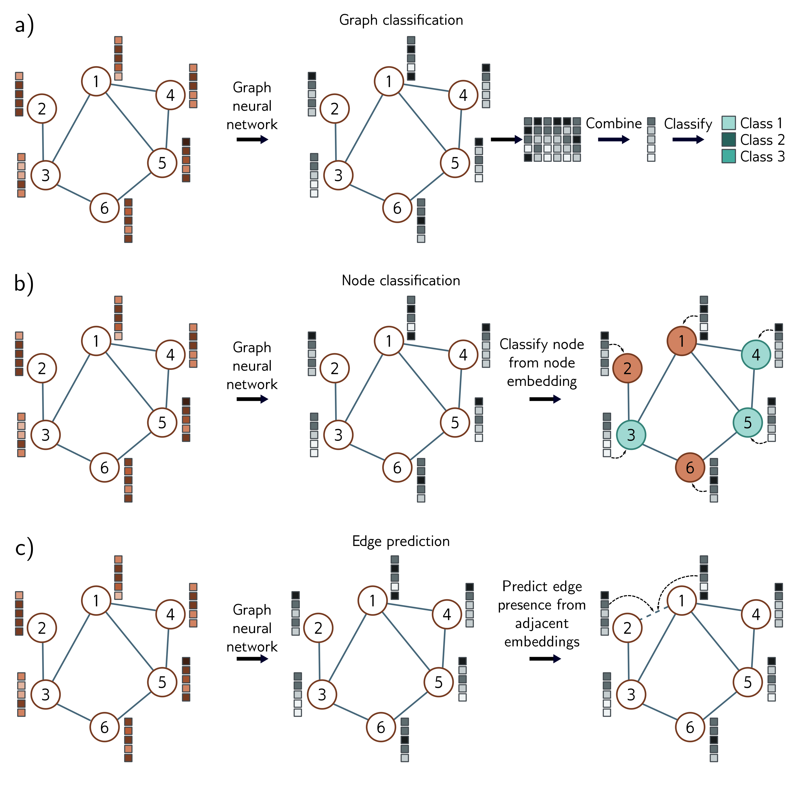

  

  <strong>Figure 13.6</strong> Common tasks for graphs. In each case, the input is a graph represented by its adjacency matrix and node embeddings. The graph neural network processes the node embeddings by passing them through a series of layers. The node embeddings at the last layer contain information about both the node and its context in the graph. a) Graph classification. The node embeddings are combined (e.g., by taking the dot product) to compute a single number that is mapped via a sigmoid function to produce a probability that a missing edge should be present.

