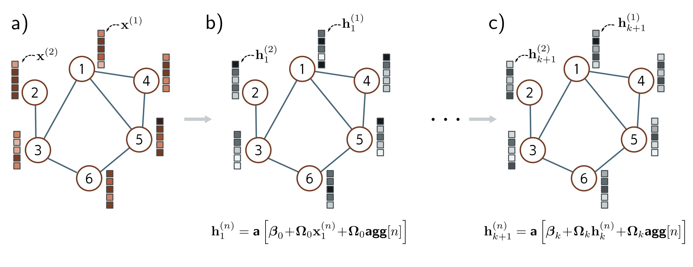

  

  <strong>Figure 13.7</strong> Simple Graph CNN layer. a) Input graph consists of structure (embodied in graph adjacency matrix A, not shown) and node embeddings (stored in columns of X). b) Each node in the first hidden layer is updated by (i) aggregating the neighboring nodes to form a single vector, (ii) applying a linear transformation  $\Omega_{0}$  to the aggregated vector, (iii) applying the same linear transformation  $\Omega_{0}$  to the original node, (iv) adding these together with a bias  $\beta_{0}$ , and finally (v) applying a nonlinear activation function  $a[\bullet]$  like a ReLU. c) This process is repeated at subsequent layers (but with different parameters for each layer) until we produce the final embeddings at the end of the network.

from a node that is “above” the node of interest differently to information from a node that is “below” it.

## 13.4.3 Example GCN layer

These considerations lead to a simple GCN layer (figure 13.7). At each node n in layer k, we aggregate information from neighboring nodes by summing their node embeddings  $h_{\bullet}$ :

$$
\mathrm{agg}[n,k]
= \sum_{m\in\mathrm{ne}[n]}\mathbf{h}_{k}^{(m)}
\qquad (13.8)
$$

where ne[n] returns the set of indices of the neighbors of node n. Then we apply a linear transformation  $\Omega_{k}$  to the embedding  $h_{k}^{(n)} + \Omega_{k} \cdot \mathbf{agg}[n, k]$ . Then we apply a weighted sum of its columns. The  $n^{th}$  column of the adjacency matrix A contains ones at the positions of the neighbors. Hence, if we collect the node

$$
\mathbf{h}_{k+1}^{(n)}
= \mathbf{a}\left[\boldsymbol{\beta}_{k}+\boldsymbol{\Omega}_{k}\mathbf{h}_{k}^{(n)}+\boldsymbol{\Omega}_{k}\mathrm{agg}[n,k]\right]
\qquad (13.9)
$$

We can write this more succinctly by noting that post-multiplication of a matrix by a vector returns a weighted sum of its columns. The  $n^{th}$  column of the adjacency matrix A contains ones at the positions of the neighbors. Hence, if we collect the node
