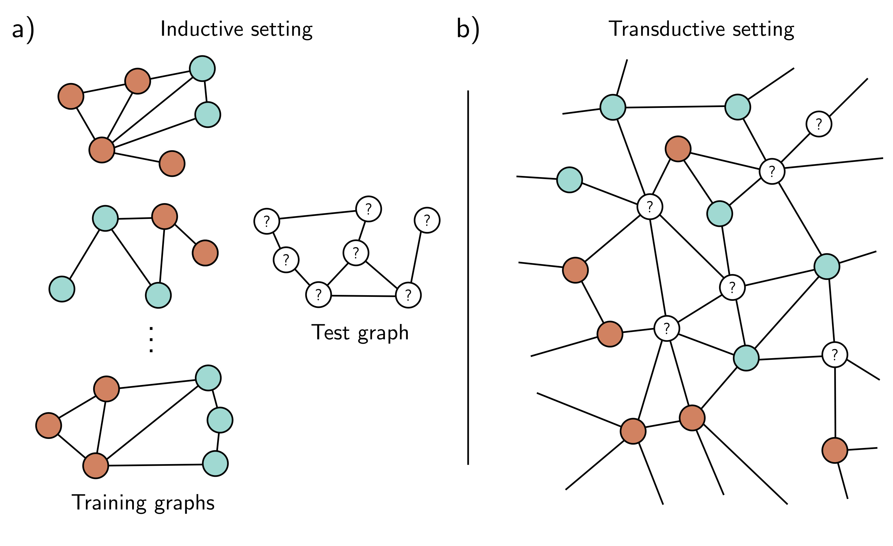

  

  <strong>Figure 13.8</strong> Inductive vs. transductive problems. a) Node classification task in the inductive setting. We are given a set of I training graphs, where the node labels (orange and cyan colors) are known. After training, we are given a test graph and must assign labels to each node. b) Node classification in the transductive setting. There is one large graph in which some nodes have labels (orange and cyan colors), and others are unknown. We train the model to predict the known label correctly and then examine the predictions at the unknown nodes.

However, each graph may have a different number of nodes. Hence, the matrices  $X_{i}$  and  $A_{i}$  have different sizes, and there is no way to concatenate them into 3D tensors.

Luckily, a simple trick allows us to process the whole batch in parallel. The graphs in the batch are treated as disjoint components of a single large graph. The network can then be run as a single instance of the network equations. The mean pooling is carried out only over the individual graphs to make a single representation per graph that can be fed into the loss function.

## 13.6 Inductive vs. transductive models

Until this point, all of the models in this book have been inductive: we exploit a training set of labeled data to learn the relation between the inputs and outputs. Then we apply this to new test data. One way to think of this is that we are learning the rule that maps inputs to outputs and then applying it elsewhere.

By contrast, a transductive model considers both the labeled and unlabeled data
