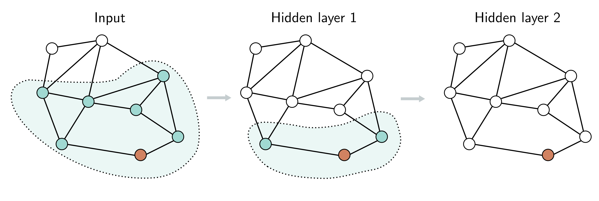

  

  <strong>Figure 13.9</strong> Receptive fields in graph neural networks. Consider the orange node in hidden layer two (right). This receives input from the nodes in the 1-hop neighborhood in hidden layer one (shaded region in center). These nodes in hidden layer two receive inputs from their neighbors in turn, and the orange node (shaded area on left). The region of the graph that contributes to a given node is equivalent to the union of a receptive field in convolutional neural networks.

on their neighbors in the layer before, so (similarly to convolutional networks) each node has a receptive field (figure 13.9). The receptive field region is termed the k-hop neighborhood. We can hence perform a gradient descent step using the graph that forms the union of the k-hop neighborhoods of the batch nodes; the remaining inputs do not contribute.

Unfortunately, if there are many layers and the graph is densely connected, every input node may be in the receptive field of every output, and this may not reduce the graph size at all. This is known as the graph expansion problem. Two approaches that tackle this problem are neighborhood sampling and graph partitioning.

Neighborhood sampling: The full graph that feeds into the batch of nodes is sampled, thereby reducing the connections at each network layer (figure 13.10). For example, we might start with the batch nodes and randomly sample a fixed number of their neighbors in the previous layer. Then, we randomly sample a fixed number of their neighbors in the layer before, and so on. The graph still increases in size with each layer but in a much more controlled way. This is done anew for each batch, so the contributing neighbors differ even if the same batch is drawn twice. This is also reminiscent of dropout (section 9.3.3) and adds some regularization.

Graph partitioning: A second approach is to cluster the original graph into disjoint subsets of nodes (i.e., smaller graphs that are not connected to one another) before processing (figure 13.11). There are standard algorithms to choose these subsets to maximize the number of internal links. These smaller graphs can each be treated as batches, or a random subset of them can be combined to form a batch (reinstating any edges between them from the original graph).
