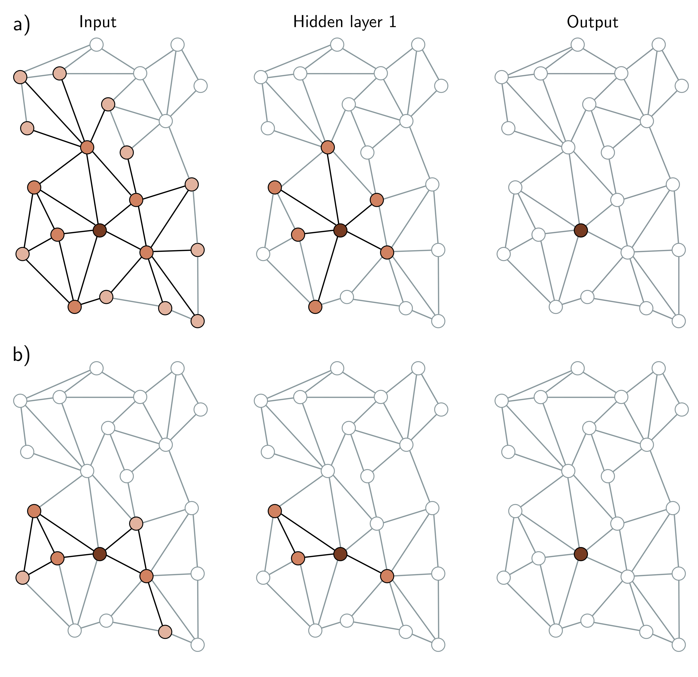

  

  <strong>Figure 13.10</strong> Neighborhood sampling. a) One way of forming batches on large graphs is to choose a subset of labeled nodes in the output layer (here, just one node in layer two, right) and then working back to find all of the nodes in the K-hop neighborhood (receptive field). Only this sub-graph is needed to train this batch. Unfortunately, if the graph is densely connected, this may retain a large proportion of the graph. b) One solution is neighborhood sampling. As we work back from the final layer, we select a subset of neighbors (here, three) in the layer before and a subset of the neighbors of these in the layer before that. This restricts the size of the graph for training the batch. In all panels, the brightness represents the distance from the original node.

Draft: please send errata to udlbookmail@gmail.com.
