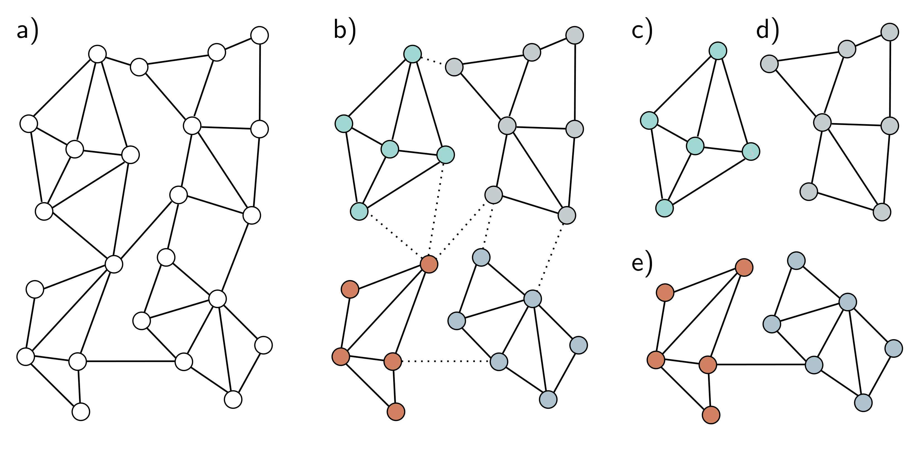

  

  <strong>Figure 13.11</strong> Graph partitioning. a) Input graph. b) The input graph is partitioned into smaller subgraphs using a principled method that removes the fewest edges. c-d) We can now use these subgraphs as batches to train in a transductive setting, so here, there are four possible batches. e) Alternatively, we can use combinations of the subgraphs as batches, reinstating the edges between them. If we use pairs of subgraphs, there would be six possible batches here.

Given one of the above methods to form batches, we can now train the network parameters in the same way as for the inductive setting, dividing the labeled nodes into train, test, and validation sets as desired; we have effectively converted a transductive problem to an inductive one. To perform inference, we compute predictions for the unknown nodes based on their k-hop neighborhood. Unlike training, this does not require storing the intermediate representations, so it is much more memory efficient.

## 13.8 Layers for graph convolutional networks

In the previous examples, we combined messages from adjacent nodes by summing them together with the transformed current node. This was accomplished by post-multiplying the node embedding matrix H by the adjacency matrix plus the identity  $A + I$ . We now consider different approaches to both (i) the combination of the current embedding with the aggregated neighbors and (ii) the aggregation process itself.
