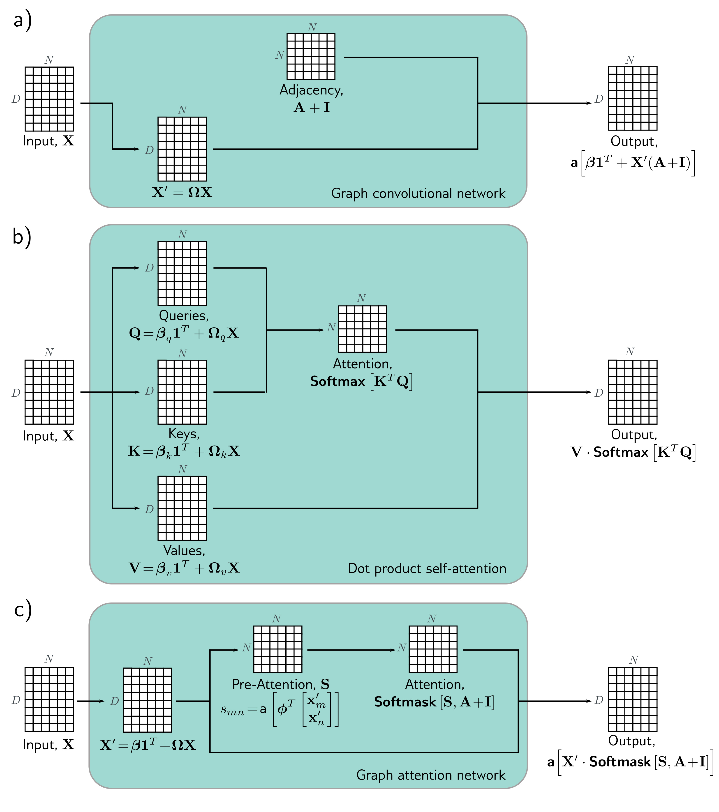

  

  <strong>Figure 13.12</strong> Comparison of graph convolutional network, dot product attention, and graph attention network. In each case, the mechanism maps N embeddings of size D stored in a $D \times N$ matrix X to an output of the same size. a) The graph convolutional network applies a linear transformation $X' = \Omega X$ to the data matrix. It then computes a weighted sum of the transformed data, where the weighting is based on the adjacency matrix. A bias $\beta$ is added, and the result is passed through an activation function. b) The outputs of the dot-product self-attention mechanism in the transformer are also weighted sums of the transformed inputs, but this time the weights depend on the data itself via the attention matrix. c) The graph attention network combines both of these mechanisms; the weights are both computed from the data and based on the adjacency matrix.

