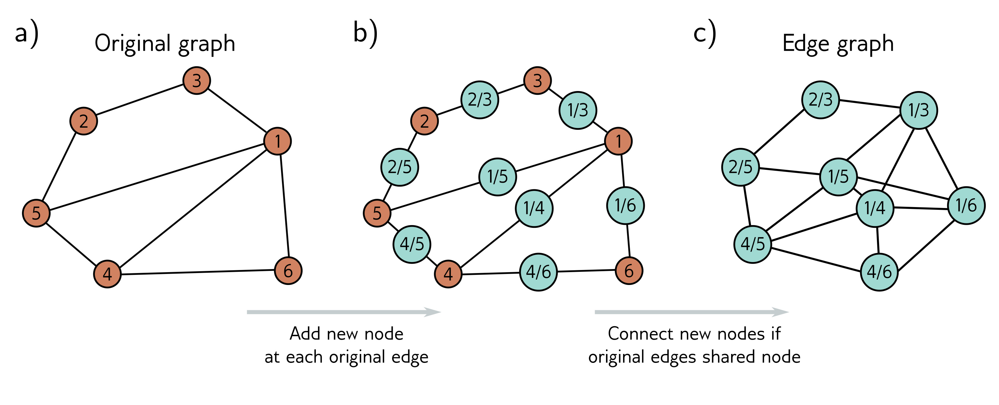

  

  <strong>Figure 13.13</strong> Edge graph. a) Graph with six nodes. b) To create the edge graph, we assign one node for each original edge (cyan circles), and c) connect the new nodes if the edges they represent connect to the same node in the original graph.

minor modifications, nodes can be updated simultaneously from both nodes and edges.

## 13.10 Summary

Graphs consist of a set of nodes, where pairs of these nodes are connected by edges. Both nodes and edges can have data attached, and these are referred to as node embeddings and edge embeddings, respectively. Many real-world problems can be framed in terms of graphs, where the goal is to establish a property of the entire graph, properties of each node or edge, or the presence of additional edges in the graph.

Graph neural networks are deep learning models that are applied to graphs. Since the node order in graphs is arbitrary, the layers of graph neural networks must be equivariant to permutations of the node indices. Spatial-based convolutional networks are a family of graph neural networks that aggregate information from the neighbors of a node and then use this to update the node embeddings.

One challenge of processing graphs is that they often occur in the transductive setting, where there is only one partially labeled graph rather than sets of training and test graphs. This graph can be extremely large, which adds further challenges in terms of training and has led to sampling and partitioning algorithms. The edge graph has a node for every edge in the original graph. By converting to this representation, graph neural networks can be used to update the edge embeddings.
